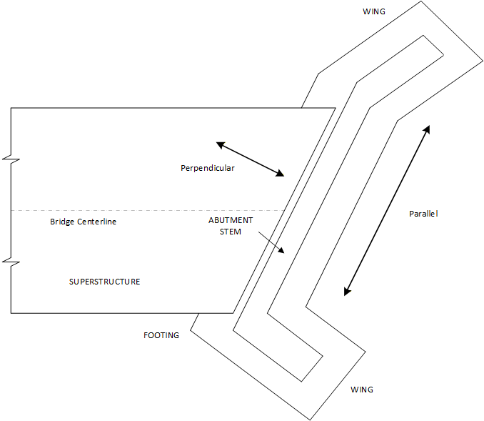

## 2.1 &emsp; General

The purpose of the LRFD Abutment and Retaining Wall Analysis and Design Program (ABLRFD) is to provide a tool for bridge engineers to analyze and design cast-in-place, reinforced concrete abutments and retaining walls. ABLRFD performs an analysis and specification check in accordance with the <u>AASHTO LRFD Bridge Design Specifications</u> and the Pennsylvania Department of Transportation <u>Design Manual Part 4</u>. As a result of a decision by the AASHTO Subcommittee on Bridges and Structures to no longer publish SI unit specifications, the program only supports US customary (US) units.

The program can either analyze an existing substructure or design a new substructure, based on the values of the input parameters entered by the user.

The program assumes a typical 1 ft strip (parallel direction) of the substructure for the structural analysis and design. The program and documentation use the terms "perpendicular" (to the stem) and "parallel" (to the stem) as shown in Figure 2.1-1.

**Figure 2.1-1** Directions
