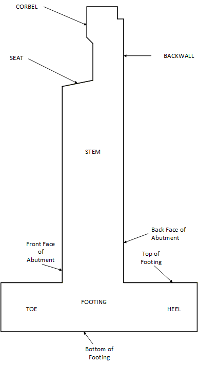
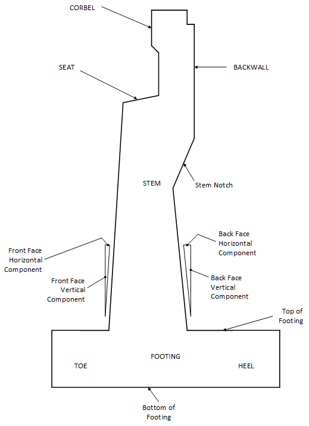
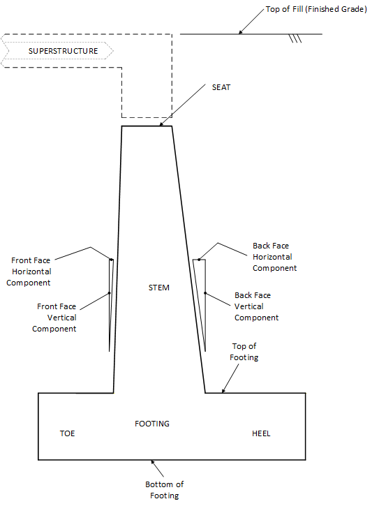
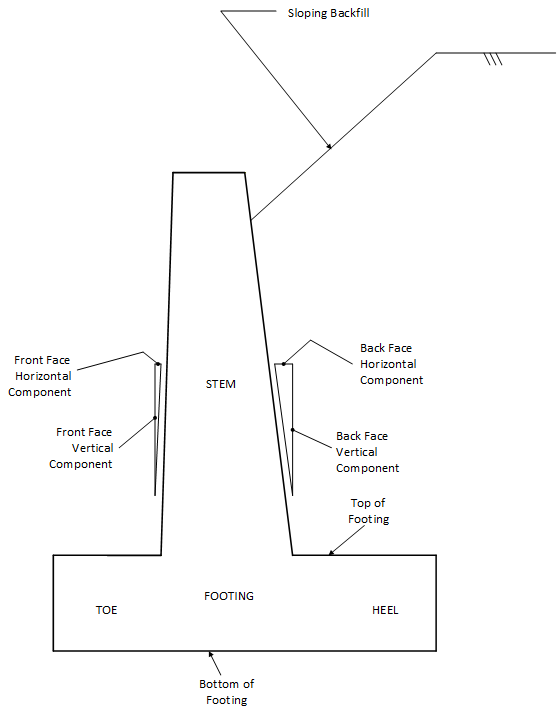

## 2.2 &emsp; Substructure Types

The program can be used to perform an analysis or design of one of four substructure types summarized below.

Abutment Type I is an abutment with a backwall and a straight stem. The stem thickness is constant below the seat such that the front and back face of the stem are completely vertical. Abutment Type I is shown in Figure 2.2-1.

Abutment Type II is an abutment with a backwall which may be offset from the stem. The front and back face of the stem below the seat may be battered. Abutment Type II is shown in Figure 2.2-2.

Abutment without backwall is an abutment that resembles a retaining wall while providing a seat for the bridge superstructure at the top of the stem. The front and back face of the stem may be battered. This abutment type may be used to describe a gravity abutment which assumes that the stem and footing are not reinforced. Gravity abutments may be analyzed only and they may not be designed. Gravity abutment toe and heel projections are small or non-existent. Abutment without backwall is shown in Figure 2.2-3.

A Retaining Wall stem may have a battered front and back face. Sloped or level backfills may be specified. The retaining wall may be used to describe a gravity wall which assumes that the stem and footing are not reinforced. Gravity wall toe and heel projections are small or non-existent. Retaining wall is shown in Figure 2.2-4.

(figure-2-2-1)=

**Figure 2.2‑1** Abutment Type I

(figure-2-2-2)=

**Figure 2.2-2** Abutment Type II

(figure-2-2-3)=

**Figure 2.2-3** Abutment without Backwall

(figure-2-2-4)=

**Figure 2.2-4** Retaining Wall
