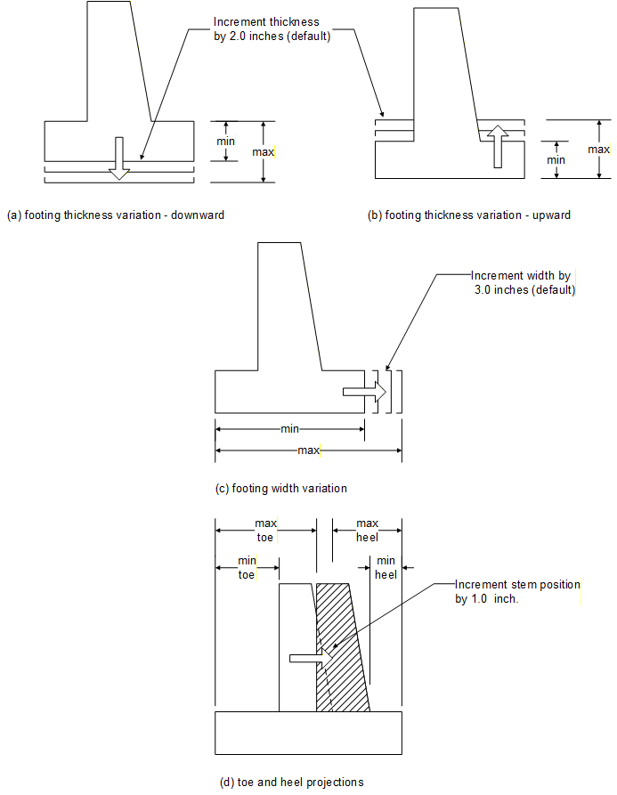
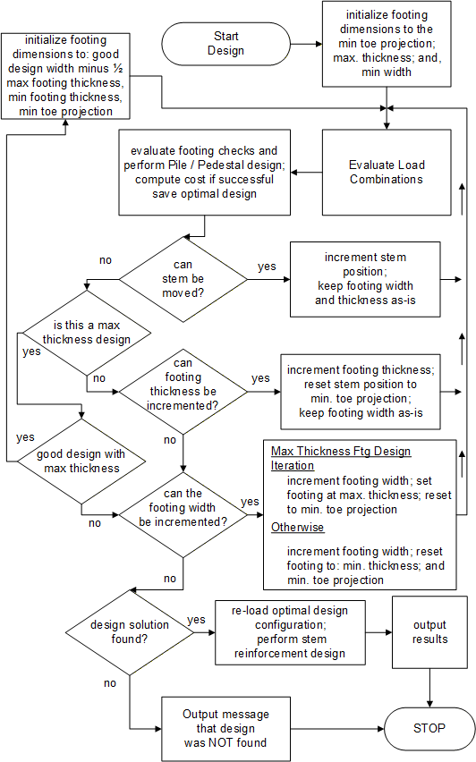
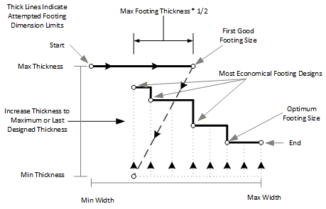

## 3.2 &emsp; Geometry

The substructure type, size, backfill slope, other substructure and foundation dimensions, and geotechnical parameters are input by the user. These dimensions and values are used to calculate the applied load effects and the structural analysis solution. The abutment backwall and stem or retaining wall stem are defined by various dimensions as shown on Figures 5.6-1, 5.7-1, 5.8-1, and 5.9-1. The footing is defined by its type as shown on Figures 5.6-1, 5.7-1, 5.8-1, 5.9-1, 5.12-1, 5.14-1, 5.14-2, 5.15-1, and 5.16-1.

A design run is viewed as a series of analysis runs for a variety of footing geometry. Essentially, all of the specification checks that would be applicable in an analysis run are considered in a design run. In an analysis run, the program simply evaluates each applicable specification check given one user-defined specified footing geometry. In a design run, the user specifies a range of values for the footing geometry. The program will check all configurations of footing geometry within that range of values, discarding those configurations that do not satisfy any of the checks. Satisfactory configurations are evaluated for their economy based on criteria selected by the user. The most economical configuration is deemed to be the optimal design solution.

The design description is organized into the following sections. Section [3.2.1](#footing-design-iteration) identifies how the footing geometry can be modified. It has a detailed description of the iteration scheme used within the program. Section [3.7](#design-considerations) addresses the special considerations for design. The 'design' algorithms and criteria for selecting the optimal design solution are described for spread footings in Section [3.7.1](#spread-footings), pedestal footings in Section [3.7.2](#pedestal-footings-1), and, pile footings in Section [3.7.3](#pilecaisson-footings).

Sections [3.5.3](#design-of-a-footing-section) and [3.6.3](#design-of-a-stem-section) describe the checks that are performed for each footing and stem cross section. They specifically address the design algorithms that are applied for the rebar checks in the footing and stem. Shear checks for design are described in Section [3.7.4](#shear-design).

### 3.2.1 &emsp; Footing Design Iteration

The scope of the footing geometry configurations that will be checked by the program is defined by user-specified maximum and minimum values for the footing thickness, footing width, toe projection, and, heel projection. These values are entered by using the FTG command (see Section [5.10](#ftg---footing-command)). Refer to Section 6.10 for further information concerning the limitations of this input.

Figure 3.2.1-1 illustrates how the footing dimensions are reconfigured. The footing thickness may be increased upwards or downwards. The width extends incrementally towards the heel side, and the stem moves incrementally from the toe side to the heel side. The following incremental values are used by default in the program:

- Footing thickness is increased by 2 inches.

- Footing width is increased by 3 inches.

- Stem location is moved by 1 inch.

If applying an incremental value causes a footing dimension to fall outside the user-specified limiting values, then the dimension is adjusted to the limiting value. For example, if the user specifies a minimum thickness of 2 ft. and a maximum thickness of 2.4 ft., the program will check footing thickness configurations of 2.0 ft, 2.17 ft, 2.33 ft, and 2.4 ft. Since 2.50 ft. exceeds the limit imposed by the user, the program will use 2.4 ft instead.

Conceptually, the footing iteration algorithm consists of combinations of width and thickness while looping through the stem positions. The description that follows is based on Figure 3.2.2-2. The figure illustrates a typical iteration scheme.

The program applies a design optimization algorithm that provides efficient footing dimension selection. The program begins by initializing the footing geometry with the minimum toe projection, maximum thickness, and minimum width. For any selected footing configuration, the applied loads are evaluated and combined as described in Section 3.3, and the applicable stability checks are evaluated, as described in Section 3.4. At this point, footing-specific designs, i.e. pile pattern layouts or pedestal geometry configurations, are evaluated as described in Section 3.7. After all of the applicable specification checks have been evaluated and are satisfied, the program determines the cost of the configuration as described in Section 3.7.

The next step is to determine if another footing configuration can be evaluated. The set of configurations is defined as: minimum and maximum toe projections; minimum heel projection; and stem position incremental value (see Figure 3.2.1-1(d)). The first parameter to be considered is the stem position. For a given footing thickness and width, the program checks a finite set of configurations of the stem location. Each stem position increment that is applied will move the stem closer to the heel. If the stem position does not reach the limit imposed by the minimum heel or maximum toe projection, the stem is repositioned by an increment and the program returns to the load evaluation stage. If the stem position reaches the minimum heel or maximum toe limit, then the design algorithm determines whether to increase the thickness or width of the footing.

(figure-3-2-1-1)=

**Figure 3.2.1-1 Incremental Positions of the Footing Geometry**

(_Toc498224297)=

**Figure 3.2.1-2 Design Algorithm for Footing Iteration Scheme**

The program begins the design by using the maximum footing thickness and iterating the footing width by the width increment until a valid design is found. When the valid design is found, the program then sets the thickness to the minimum footing thickness and reduces the footing width by one half the maximum footing thickness. However, if the water table is close enough to the footing bottom to affect bearing capacity (D10.6.3.1.2gP-2), then the thickness is reduced to the minimum footing thickness input and the footing width is reduced to the point at which the water table will not be considered in the footing design minus one half the maximum footing thickness. The footing width reduction will not reduce the footing width to less than the minimum footing width. The program then begins to check the load evaluation and increase the thickness. Refer to Figure 3.2.1-3.

(figure-3-2-1-3)=

**Figure 3.2.1-3 Typical Attempted Footing Design Dimensions**

The set of footing thickness configurations to be examined is based on the: minimum thickness, maximum thickness or last designed thickness, and thickness incremental value (Figure 3.2.1-1(b)). If the footing thickness has not reached the maximum or last designed thickness value, then the stem position is reset to the minimum toe projection and the footing thickness is incremented. The program returns to the load evaluation step with the new footing dimensions.

After the program has looped through all iterations of the footing thickness, the footing width is examined. The set of footing width positions is defined by the: minimum width, maximum width, and width incremental value (Figure 3.2.1-1(c)). Each time the footing width is incremented, the footing thickness is reset to the minimum thickness and the stem position is reset to the minimum toe projection. The program then returns to the loads evaluation step. As the footing width increases, more stem positions are examined because the toe and heel projections are defined relative to the width. The following example illustrates this.

Consider a footing with the following parameters:

- Stem thickness at the base is 4 ft.

- Minimum footing thickness is 2 ft. and maximum footing thickness is 2.25 ft.

- Minimum footing width is 8.0 ft. and maximum footing width is 10.0 ft.

- Minimum toe projection is 2 ft. and the minimum heel projection is 1 ft.

- Maximum toe and heel projections are not specified.

Table 1 shows a sample of the configurations that are checked. Configurations that are checked but not shown (for sake of brevity) in the table are widths of 8'-3"; 8'-6", 8'-9", 9'-3", 9'-6" and 9'-9".

During a design run, the progress of the program can be examined by reviewing the design status information that is displayed on the monitor. Two examples are shown in Figure 3.2.1-3.

The status information will indicate the current iteration value of the footing thickness and width. The maximum values are also shown. Furthermore, the status will indicate if a solution was found. In case (a) above, a solution has not been found; note that the footing width is 7.083 ft. In case (b), the status indicates that the current width is 8.083 ft and the program will iterate until the width is 10.917 ft. A solution was found when the footing width was 7.417 ft and the footing thickness was 2.5 ft. Section 6.10.8 describes how the program can dynamically change the maximum value of the footing width.

In summary, the program will iterate through all combinations of footing geometry as defined by the limits and incremental values. For any footing, the program will evaluate:

> 1\. loads (individual and combinations - as described in Section 3.3).
>
> 2\. footing stability checks (e.g. eccentricity, bearing pressure, sliding ... see Section 3.4).
>
> 3\. footing flexural strength checks (e.g. moment capacity, development length; see Section 3.5.2).
>
> 4\. footing serviceability checks (e.g. crack control, spacing ... see Section 3.5.2).
>
> 5\. footing shear check (see Section 3.5.2.9).

If the program cannot find a solution, the program will notify the user and then terminate. If one or more solutions has been found, the optimal footing configuration (as defined in Section 3.7) is re-evaluated, then the program will design the stem rebar by evaluating:

> 1\. stem and backwall (if applicable) strength checks (Sections 3.6.2.1 through 3.6.2.1.3).
> 
> 2\. stem and backwall (if applicable) serviceability checks (Section 3.6.2.4).
> 
> 3\. stem shear checks (Section 3.6.2.5).
> 
> 4\. stem cutoff locations and optimal stem rebar (Section 3.6.3).

<table style="width:97%;">
<caption>
 
Table 3.2.1-1 Sample Footing Configurations
</caption>
<colgroup>
<col style="width: 15%" />
<col style="width: 13%" />
<col style="width: 37%" />
<col style="width: 30%" />
</colgroup>
<tbody>
<tr>
<td style="text-align: center;">
<strong>Footing</strong>

<strong>Width</strong>
</td>
<td style="text-align: center;">
<strong>Footing</strong>

<strong>Thickness</strong>
</td>
<td style="text-align: center;"><strong>Toe Projections</strong></td>
<td style="text-align: center;"><strong>Comments</strong></td>
</tr>
<tr>
<td style="text-align: center;">8'-0"</td>
<td style="text-align: center;">2'-3"</td>
<td style="text-align: center;">2'-0", 2'-1", 2'-2", ... 2'-10", 2-11", 3'-0"</td>
<td rowspan="2" style="text-align: left;">Maximum footing thickness design</td>
</tr>
<tr>
<td style="text-align: center;">9'-0"</td>
<td style="text-align: center;">2'-3"</td>
<td style="text-align: center;">2'-0", 2'-1", 2'-2", ... 2'-10", 2-11", 3'-0"</td>
</tr>
<tr>
<td style="text-align: center;">10'-0"</td>
<td style="text-align: center;">2'-3"</td>
<td style="text-align: center;">2'-0", 2'-1", 2'-2", ... 2'-10", 2-11", 3'-0"</td>
<td style="text-align: left;">Found good design for maximum footing thickness</td>
</tr>
<tr>
<td style="text-align: center;">9'-0"</td>
<td style="text-align: center;">2'-0"</td>
<td style="text-align: center;">
2'-0", 2'-1", 2'-2", ... 2'-10", 2-11",

3'-0", 3'-1", 3'-2", ... 3'-10", 3-11", 4'-0"
</td>
<td style="text-align: left;">Reduce width, try minimum thickness</td>
</tr>
<tr>
<td style="text-align: center;"></td>
<td style="text-align: center;">2'-2"</td>
<td style="text-align: center;">
2'-0", 2'-1", 2'-2", ... 2'-10", 2-11",

3'-0", 3'-1", 3'-2", ... 3'-10", 3-11", 4'-0"
</td>
<td style="text-align: left;">New Thickness</td>
</tr>
<tr>
<td style="text-align: center;"></td>
<td style="text-align: center;">2'-3"</td>
<td style="text-align: center;">
2'-0", 2'-1", 2'-2", ... 2'-10", 2-11",

3'-0", 3'-1", 3'-2", ... 3'-10", 3-11", 4'-0"
</td>
<td style="text-align: left;">New Thickness</td>
</tr>
<tr>
<td style="text-align: center;">10'-0"</td>
<td style="text-align: center;">2'-0"</td>
<td style="text-align: center;">
2'-0", 2'-1", 2'-2", ... 2'-10", 2-11",

3'-0", 3'-1", 3'-2", ... 3'-10", 3-11",

4'-0", 4'-1", 4'-2", ... 4'-10", 4-11", 5'-0"
</td>
<td style="text-align: left;">Increase width, try minimum thickness</td>
</tr>
<tr>
<td style="text-align: center;"></td>
<td style="text-align: center;">2'-2"</td>
<td style="text-align: center;">
2'-0", 2'-1", 2'-2", ... 2'-10", 2-11",

3'-0", 3'-1", 3'-2", ... 3'-10", 3-11",

4'-0", 4'-1", 4'-2", ... 4'-10", 4-11", 5'-0"
</td>
<td style="text-align: left;">New Thickness</td>
</tr>
</tbody>
</table>

Performing Footing Design ...

Current Maximum Designed Current Maximum Designed

Thickness Thickness Thickness Width Width Width

2.833 3.500 --?-- 7.083 45.600 --?--

\(a\) A design solution has not been found yet as indicated by "---?----"

Performing Footing Design ...

Current Maximum Designed Current Maximum Designed

Thickness Thickness Thickness Width Width Width

2.500 3.500 2.500 8.083 10.917 7.417

\(b\) Current width is 8.083 ft. A solution was found when the width was 7.417 ft.

(_Toc498224298)=

**Figure 3.2.1-4 Design Status of Footing Iteration Scheme Displayed on Monitor**
