## 3.3 &emsp; Applied Load Effects

Section 2.5 briefly described the load types and combinations that are considered by the program. This section provides information about the assumptions and details associated with the loads that are computed by the program and the factors that are applied for each limit state.

### 3.3.1 &emsp; Construction Stages

Loading is based on two construction stages of the abutment or retaining wall:

- Temporary (construction) stage

- Final stage

The temporary (construction) stage simulates an abutment or retaining wall that is still under construction. The abutment is considered to be constructed and backfilled to the seat level. Bridge superstructure loads are non-existent at this stage, but a live load and earth surcharge may be applied to the backfill. Retaining walls are considered to be completely constructed with a level backfill at a point where the top of backfill meets the walls. The construction stages for abutments and retaining walls are shown in Figure 3.3.1-1(a-d), with a representation of the applicable loads.

The final stage includes all loads, backfill and abutment dimensions that the user specifies. The final stage for abutments and retaining walls are shown in Figure 3.3.1-1(a-d), with a representation of the applicable loads.

(figure-3-3-1-1a)=

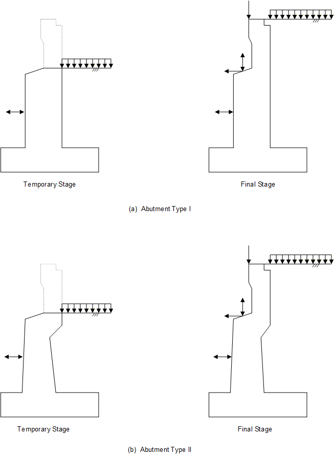

**Figure 3.3.1-1 Construction Stages**

(figure-3-3-1-1b)=

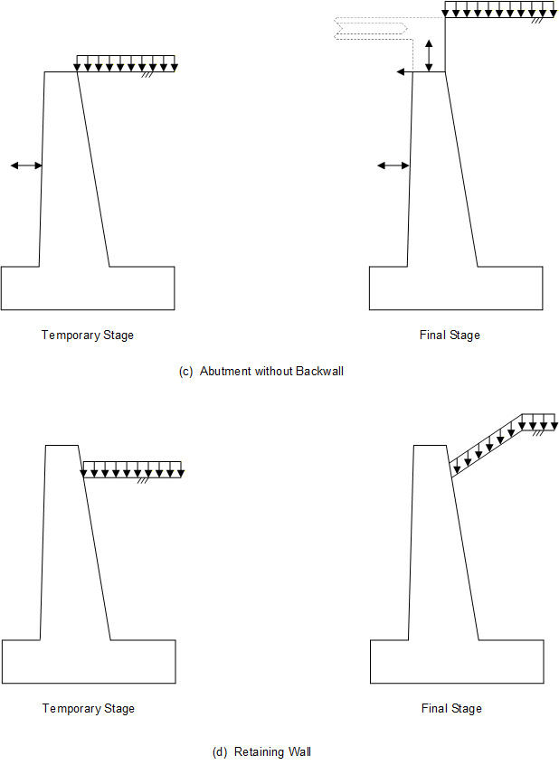

**Figure 3.3.1-1b Construction Stages (Cont.)**

### 3.3.2 &emsp; Applied Loads

LRFD applied loads are based on both user-specified data and calculated values. Applied loads depend on the stage that is being considered. The LRFD applied loads used in the abutment and retaining wall program may be grouped into the following categories:

- Dead Loads (DC, DW, EV, DCAT, DCAP, DCAS, DWAS)

- Live Loads (LL, BR, CE, PL, LLAS)

- Water Loads (WA, WA-E)

- Wind Loads (WL, WSUP, WSUP1, WSUP3, WSUP5, WSUB1, WSUB3, WSUB5)

- Earth Pressure (EH, ES, LS)

- Temperature Force Effects (TU)

- Friction Force Effects (FR)

- Earthquake Effects (EQ)

- Collision Force (CT)

Some of the applied loads are specified by the user and others are determined by the program, as shown in Table 1. Positive horizontal loads are directed toward the bridge superstructure, except in the case of water pressure at the front of the stem. Negative horizontal loads are directed away from the bridge superstructure. Vertical loads are directed downward toward the footing except for the vertical wind on superstructure load (WSUP) and the upward live load forces. The following sections describe the LRFD applied loads in more detail. Tables 1-5 provide a summary of the applied loads considered for the foundation analysis, footing analysis, stem analysis, and backwall analysis.

#### 3.3.2.1 &emsp; DC

DC is the dead load due to the weight of the abutment (including backwall) or retaining wall. It is computed using the area of the structure above the point of interest and the concrete density. For the final stage of an abutment, DC includes the weight of the superstructure. For the final stage of a retaining wall, DC includes the weight of a parapet and noise wall if present.

#### 3.3.2.2 &emsp; DW

DW is the dead load due to the weight of utilities, wearing surfaces, and future overlays. DW is only applicable for the final stage of an abutment, and includes DW from the superstructure and the future wearing surface.

For abutments without approach slabs (no ASL command (Section 5.31) has been entered), the program calculates DW effects assuming a load of 30 psf over the backwall, stem, and backfill over the heel of the abutment. The calculated DW load effects are shown in the program output as the DW-A load.

(figure-3-3-2-1)=

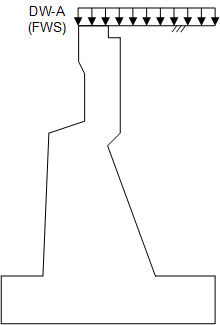

**Figure 3.3.2-1 DW-A Load Applied by the Program (no Approach Slab)**

For abutments with Type 1, 2, or 3 Approach Slabs (ASL command has been entered, but Type 4 input values have not been entered), the program does not calculate any additional DW-A load. The user enters all DW load acting on the approach slab with parameter 5 of the ASL command, "Approach Slab DW".

For abutments with Type 4 Approach Slabs (ASL command has been entered, with all Type 4 dimensions entered), the user enters the DW load from the approach slab on parameter 5 of the ASL command. The program also calculates effects due to a DW load over the drain trough, and potentially over the abutment heel, assuming a load of 30 psf. The effects due to the DW load over the backfill over the heel are only calculated by the program if there is flexible pavement adjacent to the tooth dam (parameter 6 of the ASL command). The calculated DW load effects are shown in the program output as the DW-A load. The limits of the DW-A load calculated by the program for Type 4 Approach Slabs are shown in Figures 5.31-5 and 5.31-6.

#### 3.3.2.3 &emsp; DCAT

DCAT is the dead load due to the weight of an architectural treatment applied to the front face of an abutment or retaining wall. The following figure shows a typical application of an architectural treatment on the front face of a stem.

(figure-3-3-2-2)=

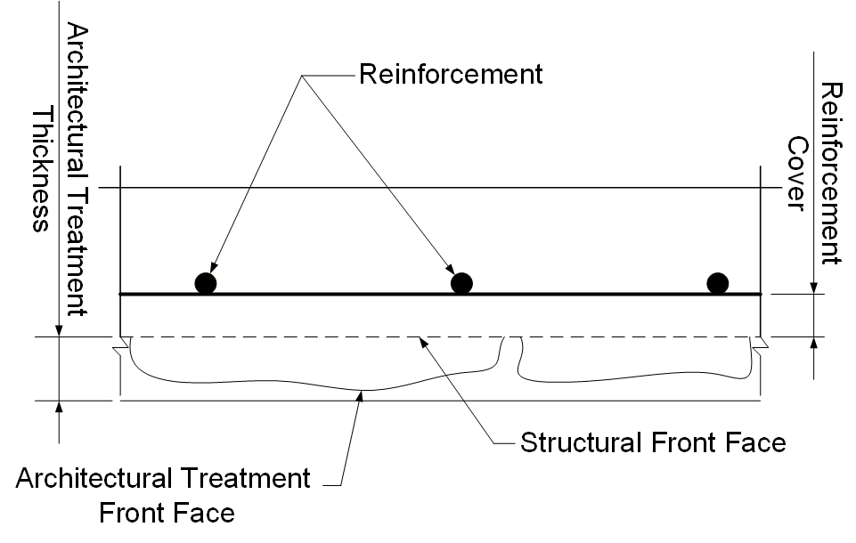

**Figure 3.3.2-2 Architectural Treatment Detail**

The area of the architectural treatment is computed using the height of the front face of the stem times the thickness of the architectural treatment as specified by the user on the structure type input command. The architectural treatment area is then multiplied by the density of the architectural treatment which is also specified by the user on the MAT command to determine the architectural treatment load. The architectural treatment density input allows the user to account for the irregularities of the architectural treatment by entering an averaged density for the entire thickness. The dead load due to the weight of an architectural treatment is applied for both the temporary and final stages of an abutment/retaining wall design or analysis.

#### 3.3.2.4 &emsp; DCAS

When the ASL command is entered, the approach slab is usually considered to be simply supported by the sleeper slab on the highway side and by the end of the beam, backwall, corbel, or Type 4 Approach Slab drain trough pedestal on the bridge side. DCAS is the dead load due to the weight of an approach slab resting upon either the backwall, beam notch, corbel, or drain trough pedestal on an abutment. It is entered by the user and is applied in the final stage of an abutment run. When the DCAS load is specified, the final Earth and Live Load Surcharge loads are not included for the final stage.

If the ASL command is used to specify a Type 4 Approach Slab, the user also has the option to specify flexible pavement adjacent to the drain trough. If flexible pavement is specified, the user is not permitted to specify a DCAS load, and the final Earth Surcharge load will be applied beyond the drain trough.

#### 3.3.2.5 &emsp; DWAS

When the ASL command is entered, the approach slab is considered to be simply supported by the sleeper slab on the highway side and by the end of the beam, backwall, corbel, or drain trough pedestal on the bridge side. DWAS is the dead load due to the utilities, wearing surface, and future overlays resting upon either the backwall, beam notch, corbel, or drain trough pedestal on an abutment. It is entered by the user and is applied in the final stage of an abutment run. When the DWAS load is specified, no program-calculated DW load is applied above the heel of the footing for the final stage.

#### 3.3.2.6 &emsp; DCAP 

For abutments with Type 4 Approach Slabs, DCAP is the dead load due to the weight of the drain trough, the portion of the deck slab between the drain trough and the approach slab, and drain trough support pedestals. The shaded areas in the following figures indicate the concrete extents used in calculating the DCAP loading for Type I and Type II abutments. DCAP is assumed to act only on the footing and piles, pedestals, rock, or soil below the footing, if they exist.


The volume of the drain trough and drain trough pedestals is computed using the dimensions entered on the ASL command. The volume is computed between two drain trough pedestals using the Drain Trough Support Pedestal Spacing distance. The volume is then multiplied by the density of the abutment concrete weight for DL which is also specified by the user on the MAT command to determine the DCAP load. The DCAP load computed is then divided by the Drain Trough Support Pedestal Width to determine the weight on the abutment design section. The dead load due to the weight of the drain trough and drain trough pedestals is applied for both the temporary and final stages of an abutment design or analysis.

#### 3.3.2.7 &emsp; EV

EV is the dead load due to the weight of the backfill soil. This load has a vertical component only. EV is a vertical load that is applied to the heel of the footing and to an inclined stem back face. For backfill soil above the water level, the moist unit weight of soil (entered on MAT input card) is used. The saturated unit weight of soil (entered on MAT input card) is used for backfill soil below the water level. Soil above the toe is neglected for force calculations due to unreliable front soil height conditions due to erosion, scour, etc.

#### 3.3.2.8 &emsp; EH

EH is the lateral earth pressure computed by considering the active condition of the backfill soil. ABLRFD determines whether to use Rankine or Coulomb procedures for calculation of the active earth pressure coefficient (K{sub}`a`). The procedure chosen is a function of where the soil’s failure surface intersects the stem. For retaining walls with a broken backfill slope, empirical curves (see DM-4) are used to determine the active earth pressure coefficient.

EH is computed using the following general equation. The corresponding pressure distributions are illustrated in Figure 3.3.2-4. For spread footings embedded in rock, the soil wedge begins at the embedment point along the heel face. For all other cases, the soil wedge begins at the bottom of the footing heel. The wedge extends towards the structure as illustrated in Figure 3.3.2-5.

For spread footings embedded in rock, the height H, is measured to the top of the rock layer. For all other cases, it is measured to the bottom of the footing.

$$EH = EH_1 + EH_2 + EH_3$$

Where:

$$EH_1 = 0.5 (K_{ah}) (\gamma_D) (H-H_w)^2$$

$$EH_2 = (K_{ah}) (\gamma_D) (H-H_w) (H_w)$$

$$EH_3 = 0.5 (K_{ah}) (\gamma_S - \gamma_W) (H_w)^2$$

(figure-3-3-2-4)=

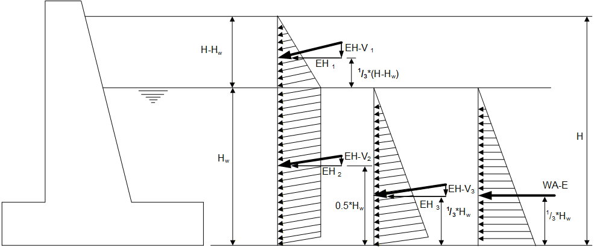

**Figure 3.3.2-4 Illustration of EH and WA-E Loads**

When computing the horizontal component of EH, K{sub}`ah` is used for K{sub}`a` in the above equations. For the vertical component, K{sub}`av` is used for K{sub}`a`, H is the height of the backfill soil and H{sub}`w` is the height of the water.

The remainder of this section describes how the coefficient of active earth pressure (K{sub}`a`) is evaluated. Coulomb Theory is used to compute K{sub}`a` if the structure is a gravity wall. For all other structures, the program computes the angle of a soil failure wedge (See Figure 3.3.2-5). Coulomb Theory is used to compute K{sub}`a` if the soil wedge intersects the back face of the stem. For structures with a large heel projection where the soil wedge may not intersect the stem, Rankine Theory is used to compute K{sub}`a`.

(figure-3-3-2-5)=

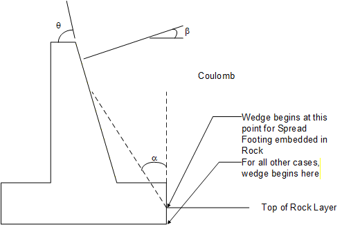

**Figure 3.3.2-5 Illustration of Soil Wedge**

The angle of the soil wedge is computed according to the following equation:

$$
\alpha = \frac{1}{2}\left( 90^{\circ} + \beta - \varphi' - \varepsilon \right)
$$

Where: 

$$\varepsilon = \sin^{- 1}\left( \frac{\sin\beta}{\sin\varphi'} \right)$$

α = angle of the soil wedge measured from the vertical

β = backfill slope angle measured from the horizontal

φ' = backfill internal friction angle

For spread footings embedded in rock, the soil wedge begins at the embedment point along the heel face. For all other cases, the soil wedge begins at the bottom of the footing heel. The wedge extends towards the structure as illustrated in Figure 3.3.2-5. If the soil wedge intersects the back face of the stem at a point that is backfilled, Coulomb Theory is used to compute K{sub}`a`. For example, if the soil wedge intersects the back face of a retaining wall stem, but the intersection occurs at the exposed back face of the stem, Rankine Theory would be applicable. A typical soil wedge is illustrated in Figure 3.3.2-5.

Once the failure mode is determined, K{sub}`a` is computed and broken into horizontal and vertical components using the equations that follow:

<u>Coulomb Theory (LRFD Specifications Equation 3.11.5.3-1)</u>:

$$K_a = \frac{\sin^2\left( \theta + \varphi' \right)}{\Gamma\sin^2(\theta)\sin(\theta - \delta)}$$

Where (LRFD Specifications Equation 3.11.5.3-2):

$$\Gamma = \left\lbrack 1 + \sqrt{\frac{\sin\left( \varphi' + \delta \right)\sin\left( \varphi' - \beta \right)}{\sin(\theta - \delta)\sin(\theta + \beta)}} \right\rbrack$$


 $\delta = \frac{1}{2}\varphi'$ Wall Friction Angle

θ = Angle of back face of wall to the vertical

$$K_{ah} = K_a \cos (\delta + 90 - \theta)$$

$$K_{av} = K_a \sin (\delta + 90 - \theta)$$

<u>Rankine Theory (DM-4 Equation 3.11.5.8.1-2)</u>:

$$K_a = \cos(\beta)\frac{\cos(\beta) - \sqrt{\cos^2(\beta) - \cos^2\left( \varphi' \right)}}{\cos(\beta) + \sqrt{\cos^2(\beta) - \cos^2\left( \varphi' \right)}}$$

Where:

$$K_{ah} = K_a \cos(\beta)$$

$$K_{av} = K_a \sin(\beta)$$

<u>Broken Backfill:</u>

If the backfill on a retaining wall is broken, the program will derive the vertical and horizontal Ka values from Figure 3.3.2-6 below. The figure is based on the 1993 LFD DM-4 Figure 5.5.2(B) Type 2 Soil which assumes a soil unit weight of 120 pcf and an effective angle of friction of 33{sup}`O`.

K{sub}`av` Curves

1.75:1

1.5:1

2:1

3:1

K{sub}`ah` Curves

1.5:1

1.75:1

2:1

3:1

6:1

(_Toc376871651)=

**Figure 3.3.2-6 Broken Backfill K{sub}`a` Values**

Note: The values obtained from Figure 3.3.2-6 are not to be less than the User Inputted Equivalent Fluid Pressure from the MAT input card.

The height ratio is the vertical distance from the height of soil above the point of analysis to the break, divided by, the height of soil above the analysis point. Below is a figure depicting this ratio.

(figure-3-3-2-7)=

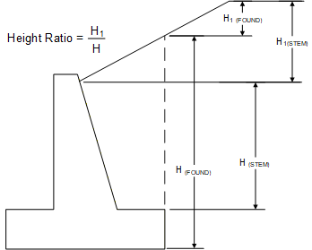

**Figure 3.3.2-7 Broken Backfill Soil Height Ratio**

#### 3.3.2.9 &emsp; EH-V

The EH-V force occurs when the EH force has a vertical component, i.e. when K{sub}`av` is non-zero. The calculation of this vertical force is shown below. The first section shows how the force is calculated for the overall structure while the second section shows the method to calculate the force for internal footing use. For methods of Ka calculation, refer to Section 3.3.2.8. Refer to Figure 3.3.2-4.

##### 3.3.2.9.1 &emsp; Overall EH-V Equations

The following equations are used when the program is calculating the overall force effects of the horizontal earth pressure in the vertical direction.

$$EH\text{-}V = EH\text{-}V_1 + EH\text{-}V_2 + EH\text{-}V_3$$

Where:

$$EH\text{-}V_1 = 0.5 (K_{av}) (\gamma_D) (H-H_w)^2$$

$$EH\text{-}V_2 = (K_{av}) (\gamma_D) (H-H_w) (H_w)$$

$$EH\text{-}V_3 = 0.5 (K_{av}) (\gamma_S - \gamma_W) (H_w)^2$$

##### 3.3.2.9.2 &emsp; Internal Footing EH-V Equations

The following equations for EH-V are used for computing internal footing forces, specifically the internal shear and moment in the heel of the structure. The force calculations are based on the partial force as described in the "Foundation Engineering Handbook" ({FNDHBK} Section 12.7.2).

(figure-3-3-2-8)=

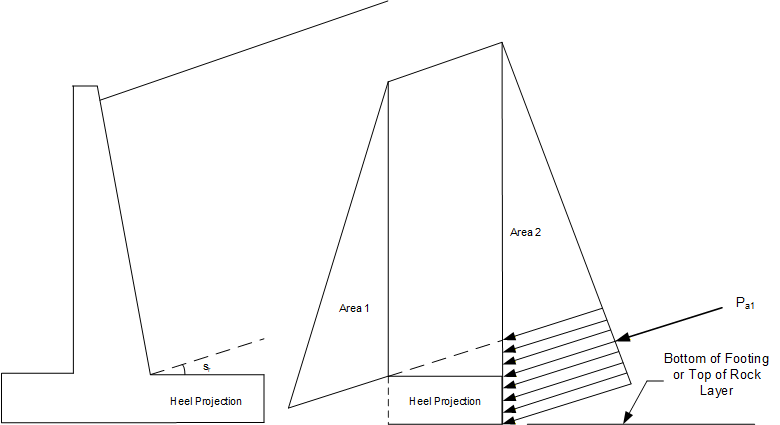

**Figure 3.3.2-8 Partial EH-V Force Diagram**

Figure 3.3.2-8 shows that when the internal forces of the heel projection are being considered, the horizontal earth pressure from Area 2 is acted upon equally by the resistance of the stem in Area 1, hence the only force considered on the heel is P{sub}`a1`. Below are the three cases based on the location of backwater which are used to calculate the partial EH-V force for internal footing forces. The following general equations apply to the three sets of equations below.

$$H_3 = F_t - t_e + H_p\left( \frac{K_{av}}{K_{ah}} \right)$$

$$H_2 = H - H_3$$

Where:

F{sub}`t` = Footing Thickness

H{sub}`p` = Heel Projection

s{sub}`r` = β (for Rankine) or δ+β (for Coulomb)

t{sub}`e` = Depth of embedment into rock (when applicable for foundations on rock)

<u>Case 1 - No back water / water below footing</u>

(figure-3-3-2-9)=

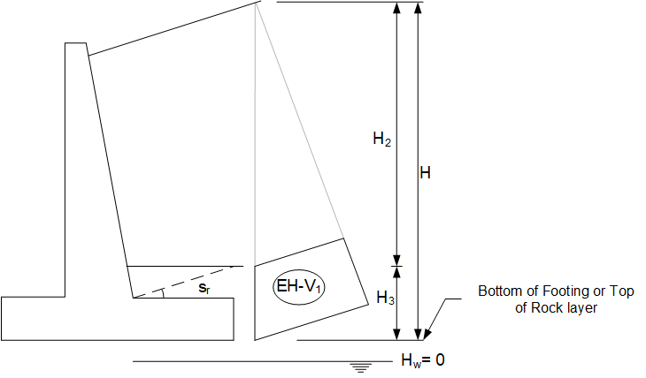

**Figure 3.3.2-9 Case 1 Area Diagram - Water Below Footing**

Equations to calculate EH-V for Case 1:

EH-V = EH-V1

> <u>Case 2 - Back water above affected area</u>

(figure-3-3-2-10)=

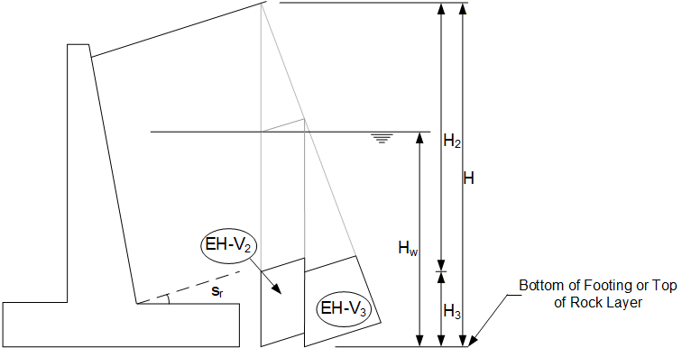

**Figure 3.3.2-10 Case 2 Area Diagram - Water Above Affected Area**

Equations to calculate EH-V for Case 2:

$$EH\text{-}V = EH\text{-}V_2 + EH\text{-}V_3$$

<u>Case 3 - Back water within affected area</u>

(figure-3-3-2-11)=

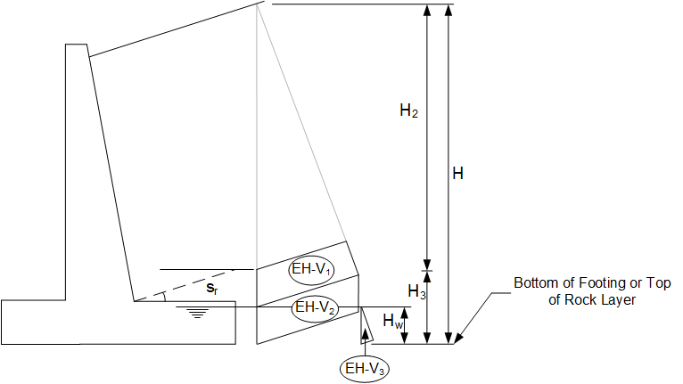

**Figure 3.3.2-11 Case 3 Area Diagram - Water Within Affected Area**

Equations to calculate EH-V for Case 3:

$$EH\text{-}V = EH\text{-}V_1 + EH\text{-}V_2 + EH\text{-}V_3$$

#### 3.3.2.10 &emsp; WA-E

WA-E is the application of the horizontal component of the water load. The horizontal component is computed by the following equation:

$$WA\text{-}E = 0.5\left( \gamma_W \right)H_w^2$$

It is applied at one third of the height as illustrated in Figure 3.3.2-4.

Note: H{sub}`w` is the depth of water from the top of the water level to the point of analysis on the structure, i.e., base of stem, bottom of footing, etc.

#### 3.3.2.11 &emsp; LS

LS is the live load surcharge applied when a vehicular load acts on the surface of the backfill, refer to Figure 3.3.2-12 and 3.3.2-13. LS is expressed as an equivalent height of backfill soil. The value of LS between may differ between the temporary stage and final stage. If approach slab loads are included in an abutment run using the ASL command, the Final LS load is not included for the final stage. LS has components in the horizontal and vertical direction. In the vertical direction, LS is computed as a uniformly distributed load on the backfill:

$$LS_v = h_{LS} \gamma_D W_{bf}$$

In the horizontal direction, the pressure due to LS is computed as follows:

$$LS_h = h_{LS} \gamma_D K_{ah} H$$

(figure-3-3-2-12)=

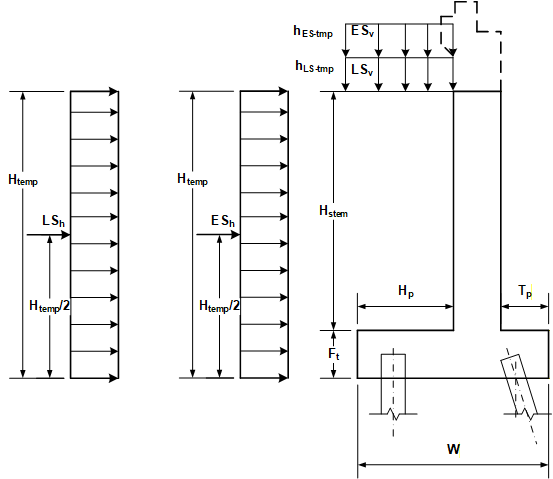

**Figure 3.3.2-12 Temporary Stage - Live Load and Dead Load Surcharge Loading**

(figure-3-3-2-13)=

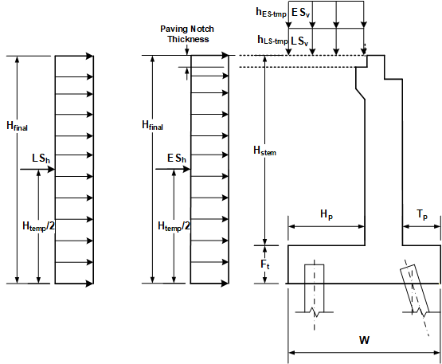

**Figure 3.3.2-13 Final Stage - Live Load and Dead Load Surcharge Loading**

#### 3.3.2.12 &emsp; ES

ES is a uniform earth surcharge that may be applied to the surface of the backfill, refer to Figures 3.3.2-12 and 3.3.2-13. ES is expressed as an equivalent height of backfill soil. The value of ES may differ between the temporary stage and final stage. For Approach Slab Types 1, 2, 3, and 4 (with no flexible pavement), if approach slab loads are included in an abutment run using the ASL command, the Final ES Load is not included for the final stage. For Type 4 Approach Slab (with flexible pavement), the Final ES load is only placed beyond the end of the drain trough. The user is not allowed to enter an ASL DCAS load for the Type 4 Approach Slab (with flexible pavement) case. ES has components in the horizontal and vertical direction. In the vertical direction, ES is computed as a uniformly distributed load on the backfill:

``` math
{ES}_{v} = h_{ES}\gamma_{D}W_{bf}
```

In the horizontal direction, the pressure due to ES is computed as follows:

``` math
{ES}_{h} = h_{ES}\gamma_{D}K_{ah}H
```

#### 3.3.2.13 &emsp; WA

WA consists of three forces, the buoyant force acting under the footing, the downward force equal to the weight of water over the toe of the footing, and the horizontal force due to water pressure on the front face of the stem. When computing buoyancy, the water levels at the front and back of the structure are considered. For a design run, when the front water level is not entered, the program will calculate this value based on the back water level and DM-4 Section 3.11.3. For analysis, if the front water level is left blank, the program places the front water level at the bottom of the footing. The program computes an area of buoyant effect below the footing as shown in Figure 3.3.2-14. The buoyant force is then determined by multiplying the area of buoyant effect by the unit weight of water.

Note: The buoyant force is not applied for spread footings on rock.

> 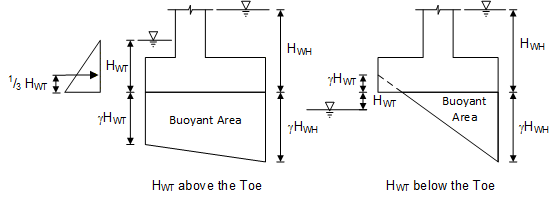

**Figure 3.3.2-14 Illustration of WA Load**

The horizontal water pressure on the front face of the stem is computed according to the following equation:

*WA =* ½ *(γ{sub}`w`) H{sub}`w`{sup}`2`*

It is applied at one third of the height as illustrated in Figure 3.3.2-14.

Note: H{sub}`w` is the depth of water from the top of the water level to the point of analysis on the structure, i.e., base of stem, bottom of footing, etc.

#### 3.3.2.14 &emsp; WSUP

WSUP is the vertical force from wind acting on a superstructure. This force is only applicable to abutments in the final stage, is only considered for the Strength-III limit state, and is assumed to be transmitted to the abutments through the bearings. The vertical force typically acts in an upward direction. This force applies only for WSUP3 wind taken perpendicular to the longitudinal axis of the bridge.

#### 3.3.2.15 &emsp; WSUP1, WSUP3, WSUP5

WSUP1, WSUP3, and WSUP5 are horizontal forces acting normal to the face of the abutment or noise wall on a retaining wall from wind acting on a superstructure or external structure attached to a retaining wall. For abutments, the transverse and longitudinal components of the wind load applied to the superstructure must be resolved into forces acting normal to the face of the abutment accounting for the skew of the abutment and fixed or expansion bearing conditions. These forces are only applicable to abutments in the final stage and is assumed to be transmitted to the abutments through the bearings. For retaining walls, the force is applied in the final stage and is transmitted to the top of the stem by a user specified vertical distance. Each load is considered for a specific limit state: WSUP1 is included in the Service-I limit state, WSUP3 is included in Strength-III, and WSUP5 is included in Strength-V. Each load must be calculated by the user with the corresponding design 3-second gust wind speed specified in LRFD Specifications Table 3.8.1.1.2-1 and input into the program. Each horizontal force is considered to act in two opposite directions. For abutments the positive direction is towards the superstructure and the negative direction is towards the abutment. For retaining walls the positive direction is the same as the vehicle collision force and the negative direction is opposite of that force. The positive forces are indicated with a plus sign (+), WSUP1+, WSUP3+, and WSUP5+. The negative forces are indicated with a minus sign (-), WSUP1-, WSUP3-, and WSUP5-.

#### 3.3.2.16 &emsp; WSUB1, WSUB3, WSUB5

WSUB1, WSUB3, and WSUB5 are the horizontal forces from wind acting normal to the face of the abutment or retaining wall on the substructure. This force is applicable to abutments and retaining walls for both the temporary and final stage. The force is transmitted into the stem from the centroid of the exposed wind area. The force is applied as a positive value or as a negative value to produce maximum force effects in the substructure. Positive forces are indicated with a plus sign (+), WSUB1+, WSUB3+, and WSUB5+. Negative forces are indicated with a minus sign (-), WSUB1-, WSUB3-, and WSUB5-. A positive value contributes to overturning. A negative value contributes to maximum pile loads in the footing heel. If a water level is specified, the exposed stem area is located between the water line and the bearing seat or top of stem. If no water level is specified, then the exposed stem area is located between the top of footing and the bearing seat or top of stem. Each load is considered for a specific limit state: WSUB1 is included in the Service-I limit state, WSUB3 is included in Strength-III, and WSUB5 is included in Strength-V. Each load must be calculated by the user with the corresponding design 3-second gust wind speed specified in LRFD Specifications Table 3.8.1.1.2-1 and input into the program.

For wind directions taken skewed to the abutment or retaining wall, the transverse and longitudinal wind loads shall be resolved into components perpendicular to the front face of the abutment or retaining wall.

For the application of the wind load on the stem, the program calculates a distributed force based on the exposed wind area then determines the applicable force and moment for each stem location. Figure 3.3.2‑15 illustrates the application of the wind on substructure load at the stem locations. The force entered corresponds to the force for Stem Loc D.

(figure-3-3-2-15)=

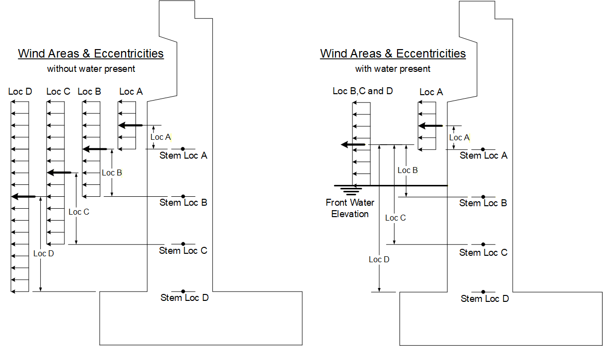

**Figure 3.3.2-15 Application of Wind at Stem Locations**

#### 3.3.2.17 &emsp; WL

WL is the horizontal force acting on the bearing due to wind acting on the superstructure live load. Transverse and longitudinal wind load components are applied to the live load with the skew angle measured from the perpendicular to the longitudinal axis of the bridge. These components must be resolved into longitudinal components normal to the face of the abutment accounting for the abutment skew and bearing conditions. The force is applied as a positive value or as a negative value to produce maximum force effects in the abutment. Positive values are indicated with a plus sign (+), WL+. Negative values are indicated with a minus sign (-), WL-. This force is only applicable to abutments in the final stage and is assumed to be transmitted to the abutments through the bearings.

#### 3.3.2.18 &emsp; PL

PL is the vertical live load due to pedestrians acting on the superstructure. This force is only applicable to abutments in the final stage and is assumed to be transmitted to the abutments through the bearings.

#### 3.3.2.19 &emsp; LL

LL is the vertical live load acting on the structure. Live load is only applicable to abutments in the final stage and as assumed to be transmitted to the abutments through the bearings. A downward live load may be applied to the front top corner of the backwall as shown in Figure 5.30-1. A horizontal live load may be applied to the top of the backwall as shown in Figure 5.30-1. The backwall live load is only applied to the backwall and is not used in evaluating the loads applied to the stem or footing. A design live load acting on the superstructure and applied at the abutment bearing seat, may be specified in the upward and downward direction. A permit design live load is applied in the same way as the design live load, but is only used the Strength II limit state. A special live load is applied in the same way as the design live load, but the special and design live loads are mutually exclusive (i.e., both may not be specified) in the same run.

#### 3.3.2.20 &emsp; LLAS

When the ASL command is entered, the approach slab is usually considered to be simply supported by the sleeper slab on the highway side and by the end of the beam, backwall, corbel, or Type 4 Approach Slab drain trough pedestal on the bridge side. LLAS is the live load acting on an approach slab either resting upon the backwall, beam notch, corbel, or drain trough on an abutment. It is entered by the user and is applied in the final stage of an abutment run. When the LLAS load is specified, the final Earth and Live Load Surcharge loads are not included for the final stage.

If the ASL command is used to specify a Type 4 Approach Slab, the user also has the option to specify flexible pavement adjacent to the drain trough. If flexible pavement is specified, the user is permitted to specify an LLAS load for the live load directly over the drain trough wall, and the final Live Load Surcharge load will be applied beyond the drain trough.

#### 3.3.2.21 &emsp; BR

BR is the horizontal braking force from the live load acting on the superstructure. This force is only applicable to abutments in the final stage and is assumed to be transmitted to the abutments through the bearings. Braking force for the design, permit design, or special live load may be applied, but special live load may not be specified in the same run with design or permit design live load. The force is applied as a positive value or as a negative value to produce maximum force effects in the abutment. Positive values are indicated with a plus sign (+), BR+D, BR+P, or BR+S. Negative values are indicated with a minus sign (-), BR-D, BR-P, or BR-S. This force must be resolved into a component normal to the face of the abutment to account for the abutment skew.

#### 3.3.2.22 &emsp; CE

CE is the horizontal centrifugal force from the live load acting on the superstructure. This force is only applicable to abutments in the final stage and is assumed to be transmitted to the abutments through the bearings. Centrifugal force for the design, permit design, or special live load may be applied, but special live load may not be specified in the same run with design or permit design live load.

#### 3.3.2.23 &emsp; TU

TU is the horizontal force on the abutment induced by thermal expansion or contraction of the superstructure. TU is only applicable for abutments, is only considered in the final stage, and is assumed to be transmitted to the abutments through the bearings. The force is applied as a positive force for thermal expansion and as a negative force for thermal contraction. Positive values are indicated with a plus sign (+), TU+. Negative values are indicated with a minus sign (-), TU-. This force must be resolved into a component normal to the face of the abutment to account for the abutment skew.

#### 3.3.2.24 &emsp; FR

FR is the horizontal force on the abutment induced by friction in sliding type expansion bearings. FR is only applicable for abutments, is only considered in the final stage, and is transmitted to the abutment at the bearings. The force is applied as a positive force for expansion and as a negative force for contraction. Positive values are indicated with a plus sign (+), FR+. Negative values are indicated with a minus sign (‑), FR-. This force must be resolved into a component normal to the face of the abutment to account for the abutment skew.

#### 3.3.2.25 &emsp; EQ

EQ is the total earthquake force acting on the structure. EQ is applicable for all structure types. It is applied in the final stage only. This load is only considered in the Extreme Event I limit state. EQ is composed of earth pressure due to earthquake force and, for abutments only, a user-specified Horizontal Superstructure Force from the superstructure for abutments and user-specified Horizontal External Structure Force for retaining walls. In calculating the EQ forces, the earth pressure due to earthquake force is initially set by the program to be the same as EH (see Section [3.3.2.8](#eh) above), but may be modified by a user input values for Response Modification factor (see Section 6.35.1) and Soil Pressure Factor for abutments and retaining walls (see Section 6.35.2).

The program calculates the earthquake load (EQ) as follows:

$$EQ = \frac{(EH) \times SoiFact + SupFor}{ResFact} \quad \text{(Abutments)}$$

$$EQ = \frac{(EH) \times SoiFact + ExtFor}{ResFact} \quad \text{(Retaining Walls)}$$

Where:

- The lateral earth pressure (EH), the input Horizontal Superstructure Force (SupFor) and the input Horizontal External Earthquake Force (ExtFor) are divided by the input Response Modification Factor (ResFact) to obtain the EQ force.

- Only the lateral earth pressure (EH) is multiplied by the input Soil Pressure Factor (SoiFact) to obtain the EQ force.

The vertical component of the earth pressure force (EV and EH-V) is not considered in the calculation of the EQ forces (LRFD Specifications Section 3.10.1).

#### 3.3.2.26 &emsp; CT

CT is the vehicle collision force acting on top of a parapet on a retaining wall. This force is only applicable for retaining walls in the final stage and is only applied in the Extreme Event II limit state. The user may specify the vertical distance to this force from the top of the retaining wall as shown in Figure 5.32-1.

<table style="width:98%;">
<caption><p>Table 3.3.2‑1 User or Program Applied Loads</p></caption>
<colgroup>
<col style="width: 9%" />
<col style="width: 10%" />
<col style="width: 9%" />
<col style="width: 10%" />
<col style="width: 57%" />
</colgroup>
<tbody>
<tr>
<td colspan="2" style="text-align: center;"><strong>User Specified</strong></td>
<td colspan="2" style="text-align: center;"><strong>Program Calculated</strong></td>
<td rowspan="2" style="text-align: center;"><strong>Description</strong></td>
</tr>
<tr>
<td style="text-align: center;"><strong>Vert.</strong></td>
<td style="text-align: center;"><strong>Horiz.</strong></td>
<td style="text-align: center;"><strong>Vert.</strong></td>
<td style="text-align: center;"><strong>Horiz.</strong></td>
</tr>
<tr>
<td style="text-align: center;"></td>
<td style="text-align: center;"></td>
<td style="text-align: center;">DC</td>
<td style="text-align: center;"></td>
<td style="text-align: center;">Substructure weight</td>
</tr>
<tr>
<td style="text-align: center;">DC</td>
<td style="text-align: center;"></td>
<td style="text-align: center;"></td>
<td style="text-align: center;"></td>
<td style="text-align: center;">Superstructure weight</td>
</tr>
<tr>
<td style="text-align: center;">DC</td>
<td style="text-align: center;"></td>
<td style="text-align: center;"></td>
<td style="text-align: center;"></td>
<td style="text-align: center;">Parapet weight on retaining wall</td>
</tr>
<tr>
<td style="text-align: center;">DCAS<sup>3</sup></td>
<td style="text-align: center;"></td>
<td style="text-align: center;"></td>
<td style="text-align: center;"></td>
<td style="text-align: center;">Approach slab weight</td>
</tr>
<tr>
<td style="text-align: center;">DWAS<sup>3</sup></td>
<td style="text-align: center;"></td>
<td style="text-align: center;"></td>
<td style="text-align: center;"></td>
<td style="text-align: center;">DW load on the approach slab</td>
</tr>
<tr>
<td style="text-align: center;"></td>
<td style="text-align: center;"></td>
<td style="text-align: center;">DCAP<sup>3</sup></td>
<td style="text-align: center;"></td>
<td style="text-align: center;">Type 4 Approach Slab drain trough/trough pedestal weight</td>
</tr>
<tr>
<td style="text-align: center;">DCAT</td>
<td style="text-align: center;"></td>
<td style="text-align: center;"></td>
<td style="text-align: center;"></td>
<td style="text-align: center;">Architectural Treatment weight</td>
</tr>
<tr>
<td style="text-align: center;"></td>
<td style="text-align: center;"></td>
<td style="text-align: center;">DW</td>
<td style="text-align: center;"></td>
<td style="text-align: center;">Wearing surface on backfill</td>
</tr>
<tr>
<td style="text-align: center;">DW<sup>3</sup></td>
<td style="text-align: center;"></td>
<td style="text-align: center;"></td>
<td style="text-align: center;"></td>
<td style="text-align: center;">Wearing surface on superstructure</td>
</tr>
<tr>
<td style="text-align: center;"></td>
<td style="text-align: center;"></td>
<td style="text-align: center;">EV</td>
<td style="text-align: center;"></td>
<td style="text-align: center;">Earth weight of backfill soil</td>
</tr>
<tr>
<td style="text-align: center;"></td>
<td style="text-align: center;"></td>
<td style="text-align: center;">EH</td>
<td style="text-align: center;">EH</td>
<td style="text-align: center;">Earth pressure of backfill soil</td>
</tr>
<tr>
<td style="text-align: center;">ES<sup>1</sup></td>
<td style="text-align: center;"></td>
<td style="text-align: center;">ES<sup>1</sup></td>
<td style="text-align: center;">ES<sup>1</sup></td>
<td style="text-align: center;">Earth surcharge</td>
</tr>
<tr>
<td style="text-align: center;">LS<sup>1</sup></td>
<td style="text-align: center;"></td>
<td style="text-align: center;">LS<sup>1</sup></td>
<td style="text-align: center;">LS<sup>1</sup></td>
<td style="text-align: center;">Live load surcharge</td>
</tr>
<tr>
<td style="text-align: center;"></td>
<td style="text-align: center;"></td>
<td style="text-align: center;"></td>
<td style="text-align: center;">WA</td>
<td style="text-align: center;">Water pressure on front of stem</td>
</tr>
<tr>
<td style="text-align: center;"></td>
<td style="text-align: center;"></td>
<td style="text-align: center;"></td>
<td style="text-align: center;">WA-E</td>
<td style="text-align: center;">Water pressure due to backfill soil</td>
</tr>
<tr>
<td style="text-align: center;"></td>
<td style="text-align: center;"></td>
<td style="text-align: center;">WA</td>
<td style="text-align: center;"></td>
<td style="text-align: center;">Buoyancy</td>
</tr>
<tr>
<td style="text-align: center;">WSUP<sup>3</sup></td>
<td style="text-align: center;"><p>WSUP1</p>
<p>WSUP3</p>
<p>WSUP5</p></td>
<td style="text-align: center;"></td>
<td style="text-align: center;"></td>
<td style="text-align: center;"><p>Wind on superstructure (abutments)</p>
<p>Wind load on external structure (retaining walls)</p></td>
</tr>
<tr>
<td style="text-align: center;"></td>
<td style="text-align: center;"><p>WSUB1<sup>3</sup></p>
<p>WSUB3<sup>3</sup></p>
<p>WSUB5<sup>3</sup></p></td>
<td style="text-align: center;"></td>
<td style="text-align: center;"></td>
<td style="text-align: center;">Wind on substructure</td>
</tr>
<tr>
<td style="text-align: center;"></td>
<td style="text-align: center;">WL<sup>3</sup></td>
<td style="text-align: center;"></td>
<td style="text-align: center;"></td>
<td style="text-align: center;">Wind on live load</td>
</tr>
<tr>
<td style="text-align: center;"></td>
<td style="text-align: center;">TU<sup>3</sup></td>
<td style="text-align: center;"></td>
<td style="text-align: center;"></td>
<td style="text-align: center;">Thermal force from superstructure</td>
</tr>
<tr>
<td style="text-align: center;"></td>
<td style="text-align: center;">FR<sup>3</sup></td>
<td style="text-align: center;"></td>
<td style="text-align: center;"></td>
<td style="text-align: center;">Friction force from superstructure</td>
</tr>
<tr>
<td style="text-align: center;">LL<sup>2,3</sup></td>
<td style="text-align: center;"></td>
<td style="text-align: center;"></td>
<td style="text-align: center;"></td>
<td style="text-align: center;">Live load from superstructure</td>
</tr>
<tr>
<td style="text-align: center;">LL<sup>3</sup></td>
<td style="text-align: center;"></td>
<td style="text-align: center;"></td>
<td style="text-align: center;"></td>
<td style="text-align: center;">Live load for backwall only</td>
</tr>
<tr>
<td style="text-align: center;">LLAS<sup>3</sup></td>
<td style="text-align: center;"></td>
<td style="text-align: center;"></td>
<td style="text-align: center;"></td>
<td style="text-align: center;">Live load on the approach slab</td>
</tr>
<tr>
<td style="text-align: center;">PL<sup>3</sup></td>
<td style="text-align: center;"></td>
<td style="text-align: center;"></td>
<td style="text-align: center;"></td>
<td style="text-align: center;">Pedestrian live load</td>
</tr>
<tr>
<td style="text-align: center;"></td>
<td style="text-align: center;"></td>
<td style="text-align: center;"></td>
<td style="text-align: center;"></td>
<td style="text-align: right;">(table continues on next page)</td>
</tr>
</tbody>
</table>

Notes: {sup}`1` The actual surcharge force applied to the structure are determined by the program, based on user input and geometry.

{sup}`2` These loads are specified for a design, permit design, or special live load.

{sup}`3` Applied to abutments only.

Table 3.3.2-1 User or Program Applied Loads (continued)

<table style="width:98%;">
<colgroup>
<col style="width: 9%" />
<col style="width: 8%" />
<col style="width: 10%" />
<col style="width: 10%" />
<col style="width: 57%" />
</colgroup>
<tbody>
<tr>
<td colspan="2" style="text-align: center;"><strong>User Specified</strong></td>
<td colspan="2" style="text-align: center;"><strong>Program Calculated</strong></td>
<td rowspan="2" style="text-align: center;"><strong>Description</strong></td>
</tr>
<tr>
<td style="text-align: center;"><strong>Vert.</strong></td>
<td style="text-align: center;"><strong>Horiz.</strong></td>
<td style="text-align: center;"><strong>Vert.</strong></td>
<td style="text-align: center;"><strong>Horiz.</strong></td>
</tr>
<tr>
<td style="text-align: center;"></td>
<td style="text-align: center;">BR<sup>2,3</sup></td>
<td style="text-align: center;"></td>
<td style="text-align: center;"></td>
<td style="text-align: center;">Live load braking force</td>
</tr>
<tr>
<td style="text-align: center;"></td>
<td style="text-align: center;">CE<sup>2,3</sup></td>
<td style="text-align: center;"></td>
<td style="text-align: center;"></td>
<td style="text-align: center;">Live load centrifugal force</td>
</tr>
<tr>
<td style="text-align: center;"></td>
<td style="text-align: center;">EQ<sup>3</sup></td>
<td style="text-align: center;"></td>
<td style="text-align: center;"></td>
<td style="text-align: center;">Earthquake force from superstructure</td>
</tr>
<tr>
<td style="text-align: center;"></td>
<td style="text-align: center;"></td>
<td style="text-align: center;"></td>
<td style="text-align: center;">EQ</td>
<td style="text-align: center;">Earthquake force due to earth pressure</td>
</tr>
<tr>
<td style="text-align: center;"></td>
<td style="text-align: center;">CT</td>
<td style="text-align: center;"></td>
<td style="text-align: center;"></td>
<td style="text-align: center;">Collision force applied to the parapet on top of retaining wall</td>
</tr>
</tbody>
</table>

Notes: {sup}`1` The actual surcharge force applied to the structure are determined by the program, based on user input and geometry.

{sup}`2` These loads are specified for a design, permit design, or special live load.

{sup}`3` Applied to abutments only.

<table style="width:96%;">
<caption><p>Table 3.3.2‑2 Foundation Applied Loads</p></caption>
<colgroup>
<col style="width: 9%" />
<col style="width: 9%" />
<col style="width: 10%" />
<col style="width: 10%" />
<col style="width: 55%" />
</colgroup>
<tbody>
<tr>
<td colspan="2" style="text-align: center;"><strong>Vertical</strong></td>
<td colspan="2" style="text-align: center;"><strong>Horizontal</strong></td>
<td rowspan="2" style="text-align: center;"><strong>Description</strong></td>
</tr>
<tr>
<td style="text-align: center;"><strong>Temp.</strong></td>
<td style="text-align: center;"><strong>Final</strong></td>
<td style="text-align: center;"><strong>Temp.</strong></td>
<td style="text-align: center;"><strong>Final</strong></td>
</tr>
<tr>
<td style="text-align: center;">DC<sup>1</sup></td>
<td style="text-align: center;">DC</td>
<td style="text-align: center;"></td>
<td style="text-align: center;"></td>
<td style="text-align: center;">Substructure weight</td>
</tr>
<tr>
<td style="text-align: center;"></td>
<td style="text-align: center;">DC</td>
<td style="text-align: center;"></td>
<td style="text-align: center;"></td>
<td style="text-align: center;">Superstructure weight</td>
</tr>
<tr>
<td style="text-align: center;">DCAT</td>
<td style="text-align: center;">DCAT</td>
<td style="text-align: center;"></td>
<td style="text-align: center;"></td>
<td style="text-align: center;">Architectural Treatment weight</td>
</tr>
<tr>
<td style="text-align: center;"></td>
<td style="text-align: center;">DC</td>
<td style="text-align: center;"></td>
<td style="text-align: center;"></td>
<td style="text-align: center;">Parapet weight on retaining wall</td>
</tr>
<tr>
<td style="text-align: center;"></td>
<td style="text-align: center;">DCAS<sup>3</sup></td>
<td style="text-align: center;"></td>
<td style="text-align: center;"></td>
<td style="text-align: center;">Approach slab weight</td>
</tr>
<tr>
<td style="text-align: center;"></td>
<td style="text-align: center;">DWAS<sup>3</sup></td>
<td style="text-align: center;"></td>
<td style="text-align: center;"></td>
<td style="text-align: center;">DW load on the approach slab</td>
</tr>
<tr>
<td style="text-align: center;">DCAP<sup>1,3</sup></td>
<td style="text-align: center;">DCAP<sup>3</sup></td>
<td style="text-align: center;"></td>
<td style="text-align: center;"></td>
<td style="text-align: center;">Type 4 Approach Slab drain trough/pedestal weight</td>
</tr>
<tr>
<td style="text-align: center;"></td>
<td style="text-align: center;">DW</td>
<td style="text-align: center;"></td>
<td style="text-align: center;"></td>
<td style="text-align: center;">Wearing surface on backfill</td>
</tr>
<tr>
<td style="text-align: center;"></td>
<td style="text-align: center;">DW<sup>3</sup></td>
<td style="text-align: center;"></td>
<td style="text-align: center;"></td>
<td style="text-align: center;">Wearing surface on superstructure</td>
</tr>
<tr>
<td style="text-align: center;">EV<sup>1</sup></td>
<td style="text-align: center;">EV</td>
<td style="text-align: center;"></td>
<td style="text-align: center;"></td>
<td style="text-align: center;">Earth weight of backfill soil</td>
</tr>
<tr>
<td style="text-align: center;">EH<sup>1</sup></td>
<td style="text-align: center;">EH</td>
<td style="text-align: center;">EH<sup>1</sup></td>
<td style="text-align: center;">EH</td>
<td style="text-align: center;">Earth pressure of backfill soil</td>
</tr>
<tr>
<td style="text-align: center;">ES<sup>1</sup></td>
<td style="text-align: center;">ES</td>
<td style="text-align: center;">ES<sup>1</sup></td>
<td style="text-align: center;">ES</td>
<td style="text-align: center;">Earth surcharge</td>
</tr>
<tr>
<td style="text-align: center;">LS<sup>1</sup></td>
<td style="text-align: center;">LS</td>
<td style="text-align: center;">LS<sup>1</sup></td>
<td style="text-align: center;">LS</td>
<td style="text-align: center;">Live load surcharge</td>
</tr>
<tr>
<td style="text-align: center;"></td>
<td style="text-align: center;"></td>
<td style="text-align: center;">WA</td>
<td style="text-align: center;">WA</td>
<td style="text-align: center;">Water pressure on front of stem</td>
</tr>
<tr>
<td style="text-align: center;"></td>
<td style="text-align: center;"></td>
<td style="text-align: center;">WA-E</td>
<td style="text-align: center;">WA-E</td>
<td style="text-align: center;">Water pressure due to backfill soil</td>
</tr>
<tr>
<td style="text-align: center;">WA</td>
<td style="text-align: center;">WA</td>
<td style="text-align: center;"></td>
<td style="text-align: center;"></td>
<td style="text-align: center;">Buoyancy</td>
</tr>
<tr>
<td style="text-align: center;"></td>
<td style="text-align: center;">WSUP<sup>3</sup></td>
<td style="text-align: center;"></td>
<td style="text-align: center;"><p>WSUP1</p>
<p>WSUP3</p>
<p>WSUP5</p></td>
<td style="text-align: center;"><p>Wind on superstructure (abutments)</p>
<p>Wind load on external structure (retaining walls)</p></td>
</tr>
<tr>
<td style="text-align: center;"></td>
<td style="text-align: center;"></td>
<td style="text-align: center;"><p>WSUB1<sup>3</sup></p>
<p>WSUB3<sup>3</sup></p>
<p>WSUB5<sup>3</sup></p></td>
<td style="text-align: center;"><p>WSUB1<sup>3</sup></p>
<p>WSUB3<sup>3</sup></p>
<p>WSUB5<sup>3</sup></p></td>
<td style="text-align: center;">Wind on substructure</td>
</tr>
<tr>
<td style="text-align: center;"></td>
<td style="text-align: center;"></td>
<td style="text-align: center;"></td>
<td style="text-align: center;">WL<sup>3,4</sup></td>
<td style="text-align: center;">Wind on live load</td>
</tr>
<tr>
<td style="text-align: center;"></td>
<td style="text-align: center;"></td>
<td style="text-align: center;"></td>
<td style="text-align: center;">TU<sup>3,4</sup></td>
<td style="text-align: center;">Thermal force from superstructure</td>
</tr>
<tr>
<td style="text-align: center;"></td>
<td style="text-align: center;"></td>
<td style="text-align: center;"></td>
<td style="text-align: center;">FR<sup>3,4</sup></td>
<td style="text-align: center;">Friction force from superstructure</td>
</tr>
<tr>
<td style="text-align: center;"></td>
<td style="text-align: center;">LL<sup>2,3</sup></td>
<td style="text-align: center;"></td>
<td style="text-align: center;"></td>
<td style="text-align: center;">Live load from superstructure</td>
</tr>
<tr>
<td style="text-align: center;"></td>
<td style="text-align: center;">LL<sup>3</sup></td>
<td style="text-align: center;"></td>
<td style="text-align: center;"></td>
<td style="text-align: center;">Live load for backwall only</td>
</tr>
<tr>
<td style="text-align: center;"></td>
<td style="text-align: center;">LLAS<sup>3</sup></td>
<td style="text-align: center;"></td>
<td style="text-align: center;"></td>
<td style="text-align: center;">Live load from approach slab</td>
</tr>
<tr>
<td style="text-align: center;"></td>
<td style="text-align: center;">DC</td>
<td style="text-align: center;"></td>
<td style="text-align: center;"></td>
<td style="text-align: center;">Parapet weight on retaining wall</td>
</tr>
<tr>
<td style="text-align: center;"></td>
<td style="text-align: center;">PL<sup>3</sup></td>
<td style="text-align: center;"></td>
<td style="text-align: center;"></td>
<td style="text-align: center;">Pedestrian live load</td>
</tr>
<tr>
<td style="text-align: center;"></td>
<td style="text-align: center;"></td>
<td style="text-align: center;"></td>
<td style="text-align: center;"></td>
<td style="text-align: right;">(table continues on next page)</td>
</tr>
</tbody>
</table>

Notes: {sup}`1` Temporary stage considers concrete and soil up to seat level

{sup}`2` Design, permit design, or special live load, depending on user input

{sup}`3` Applied to abutments only.

{sup}`4` Both positive and negative directions.

Table 3.3.2-2 Foundation Applied Loads (continued)

<table style="width:96%;">
<colgroup>
<col style="width: 9%" />
<col style="width: 10%" />
<col style="width: 9%" />
<col style="width: 10%" />
<col style="width: 55%" />
</colgroup>
<tbody>
<tr>
<td colspan="2" style="text-align: center;"><strong>Vertical</strong></td>
<td colspan="2" style="text-align: center;"><strong>Horizontal</strong></td>
<td rowspan="2" style="text-align: center;"><strong>Description</strong></td>
</tr>
<tr>
<td style="text-align: center;"><strong>Temp.</strong></td>
<td style="text-align: center;"><strong>Final</strong></td>
<td style="text-align: center;"><strong>Temp.</strong></td>
<td style="text-align: center;"><strong>Final</strong></td>
</tr>
<tr>
<td style="text-align: center;"></td>
<td style="text-align: center;"></td>
<td style="text-align: center;"></td>
<td style="text-align: center;">BR<sup>2,3,4</sup></td>
<td style="text-align: center;">Live load braking force</td>
</tr>
<tr>
<td style="text-align: center;"></td>
<td style="text-align: center;"></td>
<td style="text-align: center;"></td>
<td style="text-align: center;">CE<sup>2,3</sup></td>
<td style="text-align: center;">Live load centrifugal force</td>
</tr>
<tr>
<td style="text-align: center;"></td>
<td style="text-align: center;"></td>
<td style="text-align: center;"></td>
<td style="text-align: center;">EQ<sup>3</sup></td>
<td style="text-align: center;">Earthquake force from superstructure</td>
</tr>
<tr>
<td style="text-align: center;"></td>
<td style="text-align: center;"></td>
<td style="text-align: center;"></td>
<td style="text-align: center;">EQ</td>
<td style="text-align: center;">Earthquake force due to earth pressure</td>
</tr>
<tr>
<td style="text-align: center;"></td>
<td style="text-align: center;"></td>
<td style="text-align: center;"></td>
<td style="text-align: center;">CT</td>
<td style="text-align: center;">Collision force applied to the parapet on top of retaining wall</td>
</tr>
</tbody>
</table>

Notes: {sup}`1` Temporary stage considers concrete and soil up to seat level

{sup}`2` Design, permit design, or special live load, depending on user input

{sup}`3` Applied to abutments only.

{sup}`4` Both positive and negative directions.

<table style="width:93%;">
<caption><p>Table 3.3.2‑3 Footing Applied Loads</p></caption>
<colgroup>
<col style="width: 10%" />
<col style="width: 10%" />
<col style="width: 10%" />
<col style="width: 9%" />
<col style="width: 51%" />
</colgroup>
<tbody>
<tr>
<td colspan="2" style="text-align: center;"><strong>Heel</strong></td>
<td colspan="2" style="text-align: center;"><strong>Toe</strong></td>
<td rowspan="2" style="text-align: center;"><strong>Description</strong></td>
</tr>
<tr>
<td style="text-align: center;"><strong>Temp.</strong></td>
<td style="text-align: center;"><strong>Final</strong></td>
<td style="text-align: center;"><strong>Temp.</strong></td>
<td style="text-align: center;"><strong>Final</strong></td>
</tr>
<tr>
<td style="text-align: center;">DC</td>
<td style="text-align: center;">DC</td>
<td style="text-align: center;">DC</td>
<td style="text-align: center;">DC</td>
<td style="text-align: center;">Toe or heel projection weight</td>
</tr>
<tr>
<td style="text-align: center;"></td>
<td style="text-align: center;">DCAS<sup>2</sup></td>
<td style="text-align: center;"></td>
<td style="text-align: center;"></td>
<td style="text-align: center;">Approach slab weight</td>
</tr>
<tr>
<td style="text-align: center;"></td>
<td style="text-align: center;">DWAS<sup>2</sup></td>
<td style="text-align: center;"></td>
<td style="text-align: center;"></td>
<td style="text-align: center;">DW load on the approach slab</td>
</tr>
<tr>
<td style="text-align: center;">DCAP<sup>1,2</sup></td>
<td style="text-align: center;">DCAP<sup>2</sup></td>
<td style="text-align: center;"></td>
<td style="text-align: center;"></td>
<td style="text-align: center;">Type 4 Approach Slab drain trough/pedestal weight</td>
</tr>
<tr>
<td style="text-align: center;"></td>
<td style="text-align: center;">DW</td>
<td style="text-align: center;"></td>
<td style="text-align: center;"></td>
<td style="text-align: center;">Wearing surface on backfill</td>
</tr>
<tr>
<td style="text-align: center;">EV<sup>1</sup></td>
<td style="text-align: center;">EV</td>
<td style="text-align: center;"></td>
<td style="text-align: center;"></td>
<td style="text-align: center;">Earth (backfill soil) weight</td>
</tr>
<tr>
<td style="text-align: center;">EH<sup>1</sup></td>
<td style="text-align: center;">EH</td>
<td style="text-align: center;"></td>
<td style="text-align: center;"></td>
<td style="text-align: center;">Earth pressure (vertical) of backfill soil</td>
</tr>
<tr>
<td style="text-align: center;">EH<sup>1</sup></td>
<td style="text-align: center;">EH</td>
<td style="text-align: center;"></td>
<td style="text-align: center;"></td>
<td style="text-align: center;">Earth pressure (horizontal) of backfill soil</td>
</tr>
<tr>
<td style="text-align: center;">ES<sup>1</sup></td>
<td style="text-align: center;">ES</td>
<td style="text-align: center;"></td>
<td style="text-align: center;"></td>
<td style="text-align: center;">Earth surcharge</td>
</tr>
<tr>
<td style="text-align: center;">LS<sup>1</sup></td>
<td style="text-align: center;">LS</td>
<td style="text-align: center;"></td>
<td style="text-align: center;"></td>
<td style="text-align: center;">Live load surcharge</td>
</tr>
<tr>
<td style="text-align: center;">WA</td>
<td style="text-align: center;">WA</td>
<td style="text-align: center;"></td>
<td style="text-align: center;"></td>
<td style="text-align: center;">Buoyancy</td>
</tr>
<tr>
<td style="text-align: center;"></td>
<td style="text-align: center;">LLAS<sup>2</sup></td>
<td style="text-align: center;"></td>
<td style="text-align: center;"></td>
<td style="text-align: center;">Live load from approach slab</td>
</tr>
</tbody>
</table>

Notes: {sup}`1` Temporary stage considers concrete and soil up to seat level.

{sup}`2` Applied to abutments only. These loads are only applied to the footing when specified in conjunction with a Type 4 Approach Slab.

<table>
<caption><p>Table 3.3.2‑4 Stem Applied Loads</p></caption>
<colgroup>
<col style="width: 10%" />
<col style="width: 10%" />
<col style="width: 10%" />
<col style="width: 10%" />
<col style="width: 10%" />
<col style="width: 10%" />
<col style="width: 34%" />
</colgroup>
<tbody>
<tr>
<td colspan="2" style="text-align: center;"><strong>Axial</strong></td>
<td colspan="2" style="text-align: center;"><strong>Moment</strong></td>
<td colspan="2" style="text-align: center;"><strong>Shear</strong></td>
<td rowspan="2" style="text-align: center;"><strong>Description</strong></td>
</tr>
<tr>
<td style="text-align: center;"><strong>Temp.</strong></td>
<td style="text-align: center;"><strong>Final</strong></td>
<td style="text-align: center;"><strong>Temp.</strong></td>
<td style="text-align: center;"><strong>Final</strong></td>
<td style="text-align: center;"><strong>Temp.</strong></td>
<td style="text-align: center;"><strong>Final</strong></td>
</tr>
<tr>
<td style="text-align: center;">DC<sup>1</sup></td>
<td style="text-align: center;">DC</td>
<td style="text-align: center;">DC<sup>1</sup></td>
<td style="text-align: center;">DC</td>
<td style="text-align: center;"></td>
<td style="text-align: center;"></td>
<td style="text-align: center;">Substructure weight</td>
</tr>
<tr>
<td style="text-align: center;"></td>
<td style="text-align: center;">DC<sup>3</sup></td>
<td style="text-align: center;"></td>
<td style="text-align: center;">DC<sup>3,4</sup></td>
<td style="text-align: center;"></td>
<td style="text-align: center;"></td>
<td style="text-align: center;">Superstructure weight</td>
</tr>
<tr>
<td style="text-align: center;">DCAT</td>
<td style="text-align: center;">DCAT</td>
<td style="text-align: center;">DCAT</td>
<td style="text-align: center;">DCAT</td>
<td style="text-align: center;"></td>
<td style="text-align: center;"></td>
<td style="text-align: center;">Architectural Treatment weight</td>
</tr>
<tr>
<td style="text-align: center;"></td>
<td style="text-align: center;">DC</td>
<td style="text-align: center;"></td>
<td style="text-align: center;">DC</td>
<td style="text-align: center;"></td>
<td style="text-align: center;"></td>
<td style="text-align: center;">Parapet weight on retaining wall</td>
</tr>
<tr>
<td style="text-align: center;"></td>
<td style="text-align: center;">DCAS<sup>3</sup></td>
<td style="text-align: center;"></td>
<td style="text-align: center;">DCAS<sup>3</sup></td>
<td style="text-align: center;"></td>
<td style="text-align: center;"></td>
<td style="text-align: center;">Approach slab weight</td>
</tr>
<tr>
<td style="text-align: center;"></td>
<td style="text-align: center;">DWAS<sup>3</sup></td>
<td style="text-align: center;"></td>
<td style="text-align: center;">DWAS<sup>3</sup></td>
<td style="text-align: center;"></td>
<td style="text-align: center;"></td>
<td style="text-align: center;">DW load on the approach slab</td>
</tr>
<tr>
<td style="text-align: center;"></td>
<td style="text-align: center;">DW</td>
<td style="text-align: center;"></td>
<td style="text-align: center;">DW</td>
<td style="text-align: center;"></td>
<td style="text-align: center;"></td>
<td style="text-align: center;">Wearing surface on backfill</td>
</tr>
<tr>
<td style="text-align: center;"></td>
<td style="text-align: center;">DW<sup>3</sup></td>
<td style="text-align: center;"></td>
<td style="text-align: center;">DW<sup>3,4</sup></td>
<td style="text-align: center;"></td>
<td style="text-align: center;"></td>
<td style="text-align: center;">Wearing surface on superstructure</td>
</tr>
<tr>
<td style="text-align: center;">EV<sup>1</sup></td>
<td style="text-align: center;">EV</td>
<td style="text-align: center;">EV<sup>1</sup></td>
<td style="text-align: center;">EV</td>
<td style="text-align: center;"></td>
<td style="text-align: center;"></td>
<td style="text-align: center;">Earth weight of backfill soil</td>
</tr>
<tr>
<td style="text-align: center;">EH<sup>1</sup></td>
<td style="text-align: center;">EH</td>
<td style="text-align: center;">EH<sup>1</sup></td>
<td style="text-align: center;">EH</td>
<td style="text-align: center;">EH<sup>1</sup></td>
<td style="text-align: center;">EH</td>
<td style="text-align: center;">Earth pressure of backfill soil</td>
</tr>
<tr>
<td style="text-align: center;">ES<sup>1</sup></td>
<td style="text-align: center;">ES</td>
<td style="text-align: center;">ES<sup>1</sup></td>
<td style="text-align: center;">ES</td>
<td style="text-align: center;">ES<sup>1</sup></td>
<td style="text-align: center;">ES</td>
<td style="text-align: center;">Earth surcharge</td>
</tr>
<tr>
<td style="text-align: center;">LS<sup>1</sup></td>
<td style="text-align: center;">LS</td>
<td style="text-align: center;">LS<sup>1</sup></td>
<td style="text-align: center;">LS</td>
<td style="text-align: center;">LS<sup>1</sup></td>
<td style="text-align: center;">LS</td>
<td style="text-align: center;">Live load surcharge</td>
</tr>
<tr>
<td style="text-align: center;"></td>
<td style="text-align: center;"></td>
<td style="text-align: center;">WA</td>
<td style="text-align: center;">WA</td>
<td style="text-align: center;">WA</td>
<td style="text-align: center;">WA</td>
<td style="text-align: center;">Water pressure on front of stem</td>
</tr>
<tr>
<td style="text-align: center;"></td>
<td style="text-align: center;"></td>
<td style="text-align: center;">WA-E</td>
<td style="text-align: center;">WA-E</td>
<td style="text-align: center;">WA-E</td>
<td style="text-align: center;">WA-E</td>
<td style="text-align: center;">Water pressure due to backfill soil</td>
</tr>
<tr>
<td style="text-align: center;"></td>
<td style="text-align: center;">WSUP<sup>3</sup></td>
<td style="text-align: center;"></td>
<td style="text-align: center;"><p>WSUP<sup>4</sup></p>
<p>WSUP1</p>
<p>WSUP3</p>
<p>WSUP5</p></td>
<td style="text-align: center;"></td>
<td style="text-align: center;"><p>WSUP1</p>
<p>WSUP3</p>
<p>WSUP5</p></td>
<td style="text-align: center;"><p>Wind on superstructure (abutments)</p>
<p>Wind load on external structure (retaining walls)</p></td>
</tr>
<tr>
<td style="text-align: center;"></td>
<td style="text-align: center;"></td>
<td style="text-align: center;"><p>WSUB1<sup>3</sup></p>
<p>WSUB3<sup>3</sup></p>
<p>WSUB5<sup>3</sup></p></td>
<td style="text-align: center;"><p>WSUB1<sup>3</sup></p>
<p>WSUB3<sup>3</sup></p>
<p>WSUB5<sup>3</sup></p></td>
<td style="text-align: center;"><p>WSUB1<sup>3</sup></p>
<p>WSUB3<sup>3</sup></p>
<p>WSUB5<sup>3</sup></p></td>
<td style="text-align: center;"><p>WSUB1<sup>3</sup></p>
<p>WSUB3<sup>3</sup></p>
<p>WSUB5<sup>3</sup></p></td>
<td style="text-align: center;">Wind on substructure</td>
</tr>
<tr>
<td style="text-align: center;"></td>
<td style="text-align: center;"></td>
<td style="text-align: center;"></td>
<td style="text-align: center;">WL<sup>3,5</sup></td>
<td style="text-align: center;"></td>
<td style="text-align: center;">WL<sup>3,5</sup></td>
<td style="text-align: center;">Wind on live load</td>
</tr>
<tr>
<td style="text-align: center;"></td>
<td style="text-align: center;"></td>
<td style="text-align: center;"></td>
<td style="text-align: center;">TU<sup>3,5</sup></td>
<td style="text-align: center;"></td>
<td style="text-align: center;">TU<sup>3,5</sup></td>
<td style="text-align: center;">Thermal force from superstructure</td>
</tr>
<tr>
<td style="text-align: center;"></td>
<td style="text-align: center;"></td>
<td style="text-align: center;"></td>
<td style="text-align: center;">FR<sup>3,5</sup></td>
<td style="text-align: center;"></td>
<td style="text-align: center;">FR<sup>3,5</sup></td>
<td style="text-align: center;">Friction force from superstructure</td>
</tr>
<tr>
<td style="text-align: center;"></td>
<td style="text-align: center;">LL<sup>3</sup></td>
<td style="text-align: center;"></td>
<td style="text-align: center;">LL<sup>3,4</sup></td>
<td style="text-align: center;"></td>
<td style="text-align: center;"></td>
<td style="text-align: center;">Live load from superstructure</td>
</tr>
<tr>
<td style="text-align: center;"></td>
<td style="text-align: center;">LLAS<sup>3</sup></td>
<td style="text-align: center;"></td>
<td style="text-align: center;">LLAS<sup>3</sup></td>
<td style="text-align: center;"></td>
<td style="text-align: center;"></td>
<td style="text-align: center;">Live load from approach slab</td>
</tr>
<tr>
<td style="text-align: center;"></td>
<td style="text-align: center;">LL<sup>3</sup></td>
<td style="text-align: center;"></td>
<td style="text-align: center;">LL<sup>3</sup></td>
<td style="text-align: center;"></td>
<td style="text-align: center;"></td>
<td style="text-align: center;">Live load for backwall only</td>
</tr>
<tr>
<td style="text-align: center;"></td>
<td style="text-align: center;">PL<sup>3</sup></td>
<td style="text-align: center;"></td>
<td style="text-align: center;">PL<sup>3,4</sup></td>
<td style="text-align: center;"></td>
<td style="text-align: center;"></td>
<td style="text-align: center;">Pedestrian live load</td>
</tr>
<tr>
<td style="text-align: center;"></td>
<td style="text-align: center;"></td>
<td style="text-align: center;"></td>
<td style="text-align: center;"></td>
<td style="text-align: center;"></td>
<td style="text-align: center;"></td>
<td style="text-align: right;">(table continues on next page)</td>
</tr>
</tbody>
</table>

Notes: {sup}`1` Temporary stage considers concrete and soil up to seat level

{sup}`2` Design, permit design, or special live load, depending on user input.

{sup}`3` Applied to abutments only

{sup}`4` Moments are calculated in the vertical direction with a 2 inch positive eccentricity (towards the toe) for the maximum load case and a 2 inch negative eccentricity (towards the heel) for the minimum load case, from the centerline of the bearings.

{sup}`5` Only positive direction.

Table 3.3.2-4 Stem Applied Loads (continued)

<table>
<colgroup>
<col style="width: 10%" />
<col style="width: 10%" />
<col style="width: 10%" />
<col style="width: 10%" />
<col style="width: 10%" />
<col style="width: 10%" />
<col style="width: 34%" />
</colgroup>
<tbody>
<tr>
<td colspan="2" style="text-align: center;"><strong>Axial</strong></td>
<td colspan="2" style="text-align: center;"><strong>Moment</strong></td>
<td colspan="2" style="text-align: center;"><strong>Shear</strong></td>
<td rowspan="2"><strong>Description</strong></td>
</tr>
<tr>
<td style="text-align: center;"><strong>Temp.</strong></td>
<td style="text-align: center;"><strong>Final</strong></td>
<td style="text-align: center;"><strong>Temp.</strong></td>
<td style="text-align: center;"><strong>Final</strong></td>
<td style="text-align: center;"><strong>Temp.</strong></td>
<td style="text-align: center;"><strong>Final</strong></td>
</tr>
<tr>
<td style="text-align: center;"></td>
<td style="text-align: center;"></td>
<td style="text-align: center;"></td>
<td style="text-align: center;">BR<sup>2,3,5</sup></td>
<td style="text-align: center;"></td>
<td style="text-align: center;">BR<sup>2,3,5</sup></td>
<td>Live load braking force</td>
</tr>
<tr>
<td style="text-align: center;"></td>
<td style="text-align: center;"></td>
<td style="text-align: center;"></td>
<td style="text-align: center;">CE<sup>2,3</sup></td>
<td style="text-align: center;"></td>
<td style="text-align: center;">CE<sup>2,3</sup></td>
<td>Live load centrifugal force</td>
</tr>
<tr>
<td style="text-align: center;"></td>
<td style="text-align: center;"></td>
<td style="text-align: center;"></td>
<td style="text-align: center;">EQ<sup>3</sup></td>
<td style="text-align: center;"></td>
<td style="text-align: center;">EQ<sup>3</sup></td>
<td>Earthquake force from superstructure</td>
</tr>
<tr>
<td style="text-align: center;"></td>
<td style="text-align: center;"></td>
<td style="text-align: center;">EQ<sup>3</sup></td>
<td style="text-align: center;">EQ</td>
<td style="text-align: center;"></td>
<td style="text-align: center;">EQ</td>
<td>Earthquake force due to earth pressure</td>
</tr>
<tr>
<td style="text-align: center;"></td>
<td style="text-align: center;"></td>
<td style="text-align: center;"></td>
<td style="text-align: center;">CT</td>
<td style="text-align: center;"></td>
<td style="text-align: center;">CT</td>
<td>Collision force applied to the parapet on top of retaining wall</td>
</tr>
</tbody>
</table>

Notes: {sup}`1` Temporary stage considers concrete and soil up to seat level

{sup}`2` Design, permit design, or special live load, depending on user input.

{sup}`3` Applied to abutments only

> {sup}`4` Moments are calculated in the vertical direction with a 2 inch positive eccentricity (towards the toe) for the maximum load case and a 2 inch negative eccentricity (towards the heel) for the minimum load case, from the centerline of the bearings.

{sup}`5` Only positive direction.

<table style="width:100%;">
<caption><p>Table 3.3.2‑5 Backwall Applied Loads (Final Stage Only)</p></caption>
<colgroup>
<col style="width: 10%" />
<col style="width: 10%" />
<col style="width: 10%" />
<col style="width: 10%" />
<col style="width: 10%" />
<col style="width: 10%" />
<col style="width: 34%" />
</colgroup>
<tbody>
<tr>
<td colspan="2" style="text-align: center;"><strong>Axial</strong></td>
<td colspan="2" style="text-align: center;"><strong>Moment</strong></td>
<td colspan="2" style="text-align: center;"><strong>Shear</strong></td>
<td rowspan="2" style="text-align: center;"><strong>Description</strong></td>
</tr>
<tr>
<td style="text-align: center;"><strong>Temp.</strong></td>
<td style="text-align: center;"><strong>Final</strong></td>
<td style="text-align: center;"><strong>Temp.</strong></td>
<td style="text-align: center;"><strong>Final</strong></td>
<td style="text-align: center;"><strong>Temp.</strong></td>
<td style="text-align: center;"><strong>Final</strong></td>
</tr>
<tr>
<td style="text-align: center;"></td>
<td style="text-align: center;">DC</td>
<td style="text-align: center;"></td>
<td style="text-align: center;">DC</td>
<td style="text-align: center;"></td>
<td style="text-align: center;"></td>
<td style="text-align: center;">Substructure section weight</td>
</tr>
<tr>
<td style="text-align: center;"></td>
<td style="text-align: center;">DCAS<sup>1,2</sup></td>
<td style="text-align: center;"></td>
<td style="text-align: center;">DCAS<sup>1,2</sup></td>
<td style="text-align: center;"></td>
<td style="text-align: center;"></td>
<td style="text-align: center;">Approach slab weight</td>
</tr>
<tr>
<td style="text-align: center;"></td>
<td style="text-align: center;">DWAS<sup>1,2</sup></td>
<td style="text-align: center;"></td>
<td style="text-align: center;">DWAS<sup>1,2</sup></td>
<td style="text-align: center;"></td>
<td style="text-align: center;"></td>
<td style="text-align: center;">DW load on approach slab</td>
</tr>
<tr>
<td style="text-align: center;"></td>
<td style="text-align: center;">DW<sup>1,</sup></td>
<td style="text-align: center;"></td>
<td style="text-align: center;">DW<sup>1,</sup></td>
<td style="text-align: center;"></td>
<td style="text-align: center;"></td>
<td style="text-align: center;">Wearing surface on superstructure</td>
</tr>
<tr>
<td style="text-align: center;"></td>
<td style="text-align: center;">EV</td>
<td style="text-align: center;"></td>
<td style="text-align: center;">EV</td>
<td style="text-align: center;"></td>
<td style="text-align: center;"></td>
<td style="text-align: center;">Earth weight (pavement/backfill soil)</td>
</tr>
<tr>
<td style="text-align: center;"></td>
<td style="text-align: center;"></td>
<td style="text-align: center;"></td>
<td style="text-align: center;">EH</td>
<td style="text-align: center;"></td>
<td style="text-align: center;">EH</td>
<td style="text-align: center;">Earth pressure of backfill soil</td>
</tr>
<tr>
<td style="text-align: center;"></td>
<td style="text-align: center;"></td>
<td style="text-align: center;"></td>
<td style="text-align: center;">ES</td>
<td style="text-align: center;"></td>
<td style="text-align: center;">ES</td>
<td style="text-align: center;">Earth surcharge</td>
</tr>
<tr>
<td style="text-align: center;"></td>
<td style="text-align: center;"></td>
<td style="text-align: center;"></td>
<td style="text-align: center;">LS</td>
<td style="text-align: center;"></td>
<td style="text-align: center;">LS</td>
<td style="text-align: center;">Live load surcharge</td>
</tr>
<tr>
<td style="text-align: center;"></td>
<td style="text-align: center;">LL</td>
<td style="text-align: center;"></td>
<td style="text-align: center;">LL</td>
<td style="text-align: center;"></td>
<td style="text-align: center;"></td>
<td style="text-align: center;">Live load for backwall only</td>
</tr>
<tr>
<td style="text-align: center;"></td>
<td style="text-align: center;">LLAS<sup>2</sup></td>
<td style="text-align: center;"></td>
<td style="text-align: center;">LLAS<sup>2</sup></td>
<td style="text-align: center;"></td>
<td style="text-align: center;"></td>
<td style="text-align: center;">Live load for approach slab</td>
</tr>
<tr>
<td style="text-align: center;"></td>
<td style="text-align: center;"></td>
<td style="text-align: center;"></td>
<td style="text-align: center;">EQ</td>
<td style="text-align: center;"></td>
<td style="text-align: center;">EQ<sup>1</sup></td>
<td style="text-align: center;">Earthquake force from earth pressure</td>
</tr>
</tbody>
</table>

Notes: {sup}`1` Applied to Abutments only

{sup}`2` Applicability of load is based on “Approach Slab on Beam Notch” parameter on the ASL command

### 3.3.3 &emsp; Load Cases

Extreme force effects are determined for each limit state by applying maximum or minimum load factors to the applied loads. Limit state load cases are formed this way.

Use of the maximum or minimum load factor depends on the applied load direction under consideration. For example, if the vertical force acting on the abutment is to be minimized, the component dead load (DC) of the superstructure would be factored by the minimum load factor. Some applied loads have components in both the vertical and horizontal directions. These applied loads are multiplied by the maximum load factor because the horizontal force is always maximized and both components of force must be multiplied by the same factor. An example of this situation is the live load surcharge (LS).

### 3.3.4 &emsp; Limit States and Load Combinations

There are eight limit states considered by the program, namely: Service I, Strength I, Strength IP, Strength II, Strength III, Strength V, Extreme I, and Extreme II.

In addition, the program uses load factors for checking secondary and consolidation settlement (CSS).

Load combinations are performed in accordance with the LRFD specifications and superseded by the DM-4 specifications. Tables 1 and 2 identify the loads and corresponding load factors that are combined for each limit state of the temporary stage and final stage respectively. When two load factors are presented, the first load factor is the maximum load factor and the second load factor is the minimum load factor.

The applicability of a given limit state load combination is a function of the:

1\. Construction condition (temporary stage or final stage).

2\. Load case (maximum, minimum, MaxVert MinHorz, or MinVert MinHorz).

3\. Component (stem, footing, or backwall).

4\. Structure type (abutment or retaining wall).

The description of the construction condition can be found in Section 2.8.1. Vehicular type loads (LL, BR, CT...) and superstructure loads (DC) are not considered in the temporary stage load combinations because the superstructure is not constructed.

The maximum load case refers to the situation when the objective of the load combination is to maximize the downward vertical load. Similarly, the minimum load case refers to the situation when the objective of the load combination is to minimize the downward vertical force. For both the maximum and minimum load case, the horizontal load is maximized. The maximum vertical, minimum horizontal load case refers to the situation when the objective of the load combination is to maximize the downward vertical load with the horizontal load minimized by using reverseable horizontal loads in the opposite direction. The reverseable loads are wind (WL, WSUP1, WSUP3, WSUP5, WSUB1, WSUB3, and WSUB5), thermal (TU), braking force (BR), and friction (FR). The minimum vertical, minimum horizontal load case refers to the situation when the objective of the load combination is to minimize the downward vertical force with the horizontal load minimized by using reverseable horizontal loads in the opposite direction. These two load cases are considered for foundations of all types. The effects of reversing the horizontal loads are most apparent when finding the maximum loads in each pile row, depending on the abutment geometry and the pile pattern. For load types that have components in both the horizontal and vertical directions (LS, ES, EH and EQ), the load is maximized in both directions.

The program incorporates the following “rules” in the application of load combinations.

1\. If the earthquake command (Section 5.35) is not specified by the user, the Extreme I limit state is not applied.

2\. If the collision load (see Section 5.32) is not specified by the user, the Extreme II limit state is not applied.

3\. If the pedestrian live load (see Section 5.30) is not specified by the user, the Strength IP limit state is not applied.

4\. The backwall live load is only applicable for the final stage of Abutment Types I and II.

5\. The following load cases are not applicable for retaining walls:

- DC - Superstructure

- DW - Superstructure and Abutment

- Bearing Line Loads (LLIM, PL, WS, WL, BR, FR, CE, and parts of EQ)

- Substructure Wind Loads (WSUB1, WSUB3, WSUB5)

- Approach slab loads (DCAS, DWAS, LLAS, DCAP)

<table>
<caption><p>Table 3.3.4-1 Load Factor/Load Combination Table: Temporary Stage</p></caption>
<colgroup>
<col style="width: 8%" />
<col style="width: 11%" />
<col style="width: 9%" />
<col style="width: 9%" />
<col style="width: 11%" />
<col style="width: 12%" />
<col style="width: 9%" />
<col style="width: 9%" />
<col style="width: 8%" />
<col style="width: 8%" />
</colgroup>
<tbody>
<tr>
<td style="text-align: center;"><strong>Type of Load</strong></td>
<td style="text-align: center;"><strong>Service I</strong></td>
<td style="text-align: center;"><p><strong>Strength</strong></p>
<p><strong>I</strong></p></td>
<td style="text-align: center;"><strong>Strength IP</strong></td>
<td style="text-align: center;"><p><strong>Strength</strong></p>
<p><strong>II</strong></p></td>
<td style="text-align: center;"><p><strong>Strength</strong></p>
<p><strong>III</strong></p></td>
<td style="text-align: center;"><strong>Strength V</strong></td>
<td style="text-align: center;"><p><strong>Extreme</strong></p>
<p><strong>I</strong></p></td>
<td style="text-align: center;"><strong>Extreme II</strong></td>
<td style="text-align: center;"><strong>CSS</strong></td>
</tr>
<tr>
<td style="text-align: center;">DC-A</td>
<td style="text-align: center;">1.00/1.00</td>
<td style="text-align: center;">1.25/0.90</td>
<td style="text-align: center;">1.25/0.90</td>
<td style="text-align: center;">1.25/0.90</td>
<td style="text-align: center;">1.25/0.90</td>
<td style="text-align: center;">1.25/0.90</td>
<td style="text-align: center;">--</td>
<td style="text-align: center;">--</td>
<td style="text-align: center;">--</td>
</tr>
<tr>
<td style="text-align: center;">DC-S</td>
<td style="text-align: center;">--</td>
<td style="text-align: center;">--</td>
<td style="text-align: center;">--</td>
<td style="text-align: center;">--</td>
<td style="text-align: center;">--</td>
<td style="text-align: center;">--</td>
<td style="text-align: center;">--</td>
<td style="text-align: center;">--</td>
<td style="text-align: center;">--</td>
</tr>
<tr>
<td style="text-align: center;">DCAS</td>
<td style="text-align: center;">--</td>
<td style="text-align: center;">--</td>
<td style="text-align: center;">--</td>
<td style="text-align: center;">--</td>
<td style="text-align: center;">--</td>
<td style="text-align: center;">--</td>
<td style="text-align: center;">--</td>
<td style="text-align: center;">--</td>
<td style="text-align: center;">--</td>
</tr>
<tr>
<td style="text-align: center;">DCAP</td>
<td style="text-align: center;">1.00/1.00</td>
<td style="text-align: center;">1.25/0.90</td>
<td style="text-align: center;">1.25/0.90</td>
<td style="text-align: center;">1.25/0.90</td>
<td style="text-align: center;">1.25/0.90</td>
<td style="text-align: center;">1.25/0.90</td>
<td style="text-align: center;">--</td>
<td style="text-align: center;">--</td>
<td style="text-align: center;">--</td>
</tr>
<tr>
<td style="text-align: center;">DW-A</td>
<td style="text-align: center;">--</td>
<td style="text-align: center;">--</td>
<td style="text-align: center;">--</td>
<td style="text-align: center;">--</td>
<td style="text-align: center;">--</td>
<td style="text-align: center;">--</td>
<td style="text-align: center;">--</td>
<td style="text-align: center;">--</td>
<td style="text-align: center;">--</td>
</tr>
<tr>
<td style="text-align: center;">DW-S</td>
<td style="text-align: center;">--</td>
<td style="text-align: center;">--</td>
<td style="text-align: center;">--</td>
<td style="text-align: center;">--</td>
<td style="text-align: center;">--</td>
<td style="text-align: center;">--</td>
<td style="text-align: center;">--</td>
<td style="text-align: center;">--</td>
<td style="text-align: center;">--</td>
</tr>
<tr>
<td style="text-align: center;">DWAS</td>
<td style="text-align: center;">--</td>
<td style="text-align: center;">--</td>
<td style="text-align: center;">--</td>
<td style="text-align: center;">--</td>
<td style="text-align: center;">--</td>
<td style="text-align: center;">--</td>
<td style="text-align: center;">--</td>
<td style="text-align: center;">--</td>
<td style="text-align: center;">--</td>
</tr>
<tr>
<td style="text-align: center;">EV</td>
<td style="text-align: center;">1.00/1.00</td>
<td style="text-align: center;">1.35/1.0</td>
<td style="text-align: center;">1.35/1.0</td>
<td style="text-align: center;">1.35/1.0</td>
<td style="text-align: center;">1.35/1.0</td>
<td style="text-align: center;">1.35/1.0</td>
<td style="text-align: center;">--</td>
<td style="text-align: center;">--</td>
<td style="text-align: center;">--</td>
</tr>
<tr>
<td style="text-align: center;">EH</td>
<td style="text-align: center;">1.00/1.00</td>
<td style="text-align: center;">1.50/1.50</td>
<td style="text-align: center;">1.50/1.50</td>
<td style="text-align: center;">1.50/1.50</td>
<td style="text-align: center;">1.50/1.50</td>
<td style="text-align: center;">1.50/1.50</td>
<td style="text-align: center;">--</td>
<td style="text-align: center;">--</td>
<td style="text-align: center;">--</td>
</tr>
<tr>
<td style="text-align: center;">EH-V</td>
<td style="text-align: center;">1.00/1.00</td>
<td style="text-align: center;">1.50/1.50</td>
<td style="text-align: center;">1.50/1.50</td>
<td style="text-align: center;">1.50/1.50</td>
<td style="text-align: center;">1.50/1.50</td>
<td style="text-align: center;">1.50/1.50</td>
<td style="text-align: center;">--</td>
<td style="text-align: center;">--</td>
<td style="text-align: center;">--</td>
</tr>
<tr>
<td style="text-align: center;">ES</td>
<td style="text-align: center;">1.00/1.00</td>
<td style="text-align: center;">1.50/1.50</td>
<td style="text-align: center;">1.50/1.50</td>
<td style="text-align: center;">1.50/1.50</td>
<td style="text-align: center;">1.50/1.50</td>
<td style="text-align: center;">1.50/1.50</td>
<td style="text-align: center;">--</td>
<td style="text-align: center;">--</td>
<td style="text-align: center;">--</td>
</tr>
<tr>
<td style="text-align: center;">LS</td>
<td style="text-align: center;">1.00/1.00</td>
<td style="text-align: center;">1.75/1.75</td>
<td style="text-align: center;">1.50/1.50</td>
<td style="text-align: center;">1.50/1.50</td>
<td style="text-align: center;">--</td>
<td style="text-align: center;">1.50/1.50</td>
<td style="text-align: center;">--</td>
<td style="text-align: center;">--</td>
<td style="text-align: center;">--</td>
</tr>
<tr>
<td style="text-align: center;">LLDD</td>
<td style="text-align: center;">--</td>
<td style="text-align: center;">--</td>
<td style="text-align: center;">--</td>
<td style="text-align: center;">--</td>
<td style="text-align: center;">--</td>
<td style="text-align: center;">--</td>
<td style="text-align: center;">--</td>
<td style="text-align: center;">--</td>
<td style="text-align: center;">--</td>
</tr>
<tr>
<td style="text-align: center;">LLDU</td>
<td style="text-align: center;">--</td>
<td style="text-align: center;">--</td>
<td style="text-align: center;">--</td>
<td style="text-align: center;">--</td>
<td style="text-align: center;">--</td>
<td style="text-align: center;">--</td>
<td style="text-align: center;">--</td>
<td style="text-align: center;">--</td>
<td style="text-align: center;">--</td>
</tr>
<tr>
<td style="text-align: center;">LLBW</td>
<td style="text-align: center;">--</td>
<td style="text-align: center;">--</td>
<td style="text-align: center;">--</td>
<td style="text-align: center;">--</td>
<td style="text-align: center;">--</td>
<td style="text-align: center;">--</td>
<td style="text-align: center;">--</td>
<td style="text-align: center;">--</td>
<td style="text-align: center;">--</td>
</tr>
<tr>
<td style="text-align: center;">LLBH</td>
<td style="text-align: center;">--</td>
<td style="text-align: center;">--</td>
<td style="text-align: center;">--</td>
<td style="text-align: center;">--</td>
<td style="text-align: center;">--</td>
<td style="text-align: center;">--</td>
<td style="text-align: center;">--</td>
<td style="text-align: center;">--</td>
<td style="text-align: center;">--</td>
</tr>
<tr>
<td style="text-align: center;">LLAS</td>
<td style="text-align: center;">--</td>
<td style="text-align: center;">--</td>
<td style="text-align: center;">--</td>
<td style="text-align: center;">--</td>
<td style="text-align: center;">--</td>
<td style="text-align: center;">--</td>
<td style="text-align: center;">--</td>
<td style="text-align: center;">--</td>
<td style="text-align: center;">--</td>
</tr>
<tr>
<td style="text-align: center;">PL</td>
<td style="text-align: center;">--</td>
<td style="text-align: center;">--</td>
<td style="text-align: center;">--</td>
<td style="text-align: center;">--</td>
<td style="text-align: center;">--</td>
<td style="text-align: center;">--</td>
<td style="text-align: center;">--</td>
<td style="text-align: center;">--</td>
<td style="text-align: center;">--</td>
</tr>
<tr>
<td style="text-align: center;">WSUP</td>
<td style="text-align: center;">--</td>
<td style="text-align: center;">--</td>
<td style="text-align: center;">--</td>
<td style="text-align: center;">--</td>
<td style="text-align: center;">--</td>
<td style="text-align: center;">--</td>
<td style="text-align: center;">--</td>
<td style="text-align: center;">--</td>
<td style="text-align: center;">--</td>
</tr>
<tr>
<td style="text-align: center;">WSUP1</td>
<td style="text-align: center;">--</td>
<td style="text-align: center;">--</td>
<td style="text-align: center;">--</td>
<td style="text-align: center;">--</td>
<td style="text-align: center;">--</td>
<td style="text-align: center;">--</td>
<td style="text-align: center;">--</td>
<td style="text-align: center;">--</td>
<td style="text-align: center;">--</td>
</tr>
<tr>
<td style="text-align: center;">WSUP3</td>
<td style="text-align: center;">--</td>
<td style="text-align: center;">--</td>
<td style="text-align: center;">--</td>
<td style="text-align: center;">--</td>
<td style="text-align: center;">--</td>
<td style="text-align: center;">--</td>
<td style="text-align: center;">--</td>
<td style="text-align: center;">--</td>
<td style="text-align: center;">--</td>
</tr>
<tr>
<td style="text-align: center;">WSUP5</td>
<td style="text-align: center;">--</td>
<td style="text-align: center;">--</td>
<td style="text-align: center;">--</td>
<td style="text-align: center;">--</td>
<td style="text-align: center;">--</td>
<td style="text-align: center;">--</td>
<td style="text-align: center;">--</td>
<td style="text-align: center;">--</td>
<td style="text-align: center;">--</td>
</tr>
<tr>
<td style="text-align: center;">WSUB1</td>
<td style="text-align: center;">1.00/1.00</td>
<td style="text-align: center;">--</td>
<td style="text-align: center;">--</td>
<td style="text-align: center;">--</td>
<td style="text-align: center;">--</td>
<td style="text-align: center;">--</td>
<td style="text-align: center;">--</td>
<td style="text-align: center;">--</td>
<td style="text-align: center;">--</td>
</tr>
<tr>
<td style="text-align: center;">WSUB3</td>
<td style="text-align: center;"></td>
<td style="text-align: center;">--</td>
<td style="text-align: center;">--</td>
<td style="text-align: center;">--</td>
<td style="text-align: center;">1.00/1.00</td>
<td style="text-align: center;">--</td>
<td style="text-align: center;">--</td>
<td style="text-align: center;">--</td>
<td style="text-align: center;">--</td>
</tr>
<tr>
<td style="text-align: center;">WSUB5</td>
<td style="text-align: center;"></td>
<td style="text-align: center;">--</td>
<td style="text-align: center;">--</td>
<td style="text-align: center;">--</td>
<td style="text-align: center;">--</td>
<td style="text-align: center;">1.00/1.00</td>
<td style="text-align: center;">--</td>
<td style="text-align: center;">--</td>
<td style="text-align: center;">--</td>
</tr>
<tr>
<td style="text-align: center;">WL</td>
<td style="text-align: center;">--</td>
<td style="text-align: center;">--</td>
<td style="text-align: center;">--</td>
<td style="text-align: center;">--</td>
<td style="text-align: center;">--</td>
<td style="text-align: center;">--</td>
<td style="text-align: center;">--</td>
<td style="text-align: center;">--</td>
<td style="text-align: center;">--</td>
</tr>
<tr>
<td style="text-align: center;">WA</td>
<td style="text-align: center;">1.0/1.0</td>
<td style="text-align: center;">1.0/1.0</td>
<td style="text-align: center;">1.0/1.0</td>
<td style="text-align: center;">1.0/1.0</td>
<td style="text-align: center;">1.0/1.0</td>
<td style="text-align: center;">1.0/1.0</td>
<td style="text-align: center;">--</td>
<td style="text-align: center;">--</td>
<td style="text-align: center;">-</td>
</tr>
<tr>
<td style="text-align: center;">BR</td>
<td style="text-align: center;">--</td>
<td style="text-align: center;">--</td>
<td style="text-align: center;">--</td>
<td style="text-align: center;">--</td>
<td style="text-align: center;">--</td>
<td style="text-align: center;">--</td>
<td style="text-align: center;">--</td>
<td style="text-align: center;">--</td>
<td style="text-align: center;">-</td>
</tr>
<tr>
<td style="text-align: center;">CE</td>
<td style="text-align: center;">--</td>
<td style="text-align: center;">--</td>
<td style="text-align: center;">--</td>
<td style="text-align: center;">--</td>
<td style="text-align: center;">--</td>
<td style="text-align: center;">--</td>
<td style="text-align: center;">--</td>
<td style="text-align: center;">--</td>
<td style="text-align: center;">--</td>
</tr>
<tr>
<td style="text-align: center;">TU</td>
<td style="text-align: center;">--</td>
<td style="text-align: center;">--</td>
<td style="text-align: center;">--</td>
<td style="text-align: center;">--</td>
<td style="text-align: center;">--</td>
<td style="text-align: center;">--</td>
<td style="text-align: center;">--</td>
<td style="text-align: center;">--</td>
<td style="text-align: center;">--</td>
</tr>
<tr>
<td style="text-align: center;">FR</td>
<td style="text-align: center;">--</td>
<td style="text-align: center;">--</td>
<td style="text-align: center;">--</td>
<td style="text-align: center;">--</td>
<td style="text-align: center;">--</td>
<td style="text-align: center;">--</td>
<td style="text-align: center;">--</td>
<td style="text-align: center;">--</td>
<td style="text-align: center;">--</td>
</tr>
<tr>
<td style="text-align: center;">EQ</td>
<td style="text-align: center;">--</td>
<td style="text-align: center;">--</td>
<td style="text-align: center;">--</td>
<td style="text-align: center;">--</td>
<td style="text-align: center;">--</td>
<td style="text-align: center;">--</td>
<td style="text-align: center;">--</td>
<td style="text-align: center;">--</td>
<td style="text-align: center;">--</td>
</tr>
<tr>
<td style="text-align: center;">CT</td>
<td style="text-align: center;">--</td>
<td style="text-align: center;">--</td>
<td style="text-align: center;">--</td>
<td style="text-align: center;">--</td>
<td style="text-align: center;">--</td>
<td style="text-align: center;">--</td>
<td style="text-align: center;">--</td>
<td style="text-align: center;">--</td>
<td style="text-align: center;">--</td>
</tr>
</tbody>
</table>

<table>
<caption><p>Table 3.3.4-2 Load Factor/Load Combination Table: Final Stage</p></caption>
<colgroup>
<col style="width: 10%" />
<col style="width: 11%" />
<col style="width: 11%" />
<col style="width: 9%" />
<col style="width: 9%" />
<col style="width: 9%" />
<col style="width: 9%" />
<col style="width: 9%" />
<col style="width: 9%" />
<col style="width: 8%" />
</colgroup>
<tbody>
<tr>
<td style="text-align: center;"><strong>Type of Load</strong></td>
<td style="text-align: center;"><p><strong>Service</strong></p>
<p><strong>I</strong></p></td>
<td style="text-align: center;"><p><strong>Strength</strong></p>
<p><strong>I</strong></p></td>
<td style="text-align: center;"><strong>StrengthIP</strong></td>
<td style="text-align: center;"><p><strong>Strength</strong></p>
<p><strong>II</strong></p></td>
<td style="text-align: center;"><p><strong>Strength</strong></p>
<p><strong>III</strong></p></td>
<td style="text-align: center;"><p><strong>Strength</strong></p>
<p><strong>V</strong></p></td>
<td style="text-align: center;"><p><strong>Extreme</strong></p>
<p><strong>I</strong></p></td>
<td style="text-align: center;"><p><strong>Extreme</strong></p>
<p><strong>II</strong></p></td>
<td style="text-align: center;"><strong>CSS</strong></td>
</tr>
<tr>
<td style="text-align: center;">DC-A</td>
<td style="text-align: center;">1.00/1.00</td>
<td style="text-align: center;">1.25/0.90</td>
<td style="text-align: center;">1.25/0.90</td>
<td style="text-align: center;">1.25/0.90</td>
<td style="text-align: center;">1.25/0.90</td>
<td style="text-align: center;">1.25/0.90</td>
<td style="text-align: center;">1.00/1.00</td>
<td style="text-align: center;">1.00/1.00</td>
<td style="text-align: center;">1.0/1.0</td>
</tr>
<tr>
<td style="text-align: center;">DC-S</td>
<td style="text-align: center;">1.00/1.00</td>
<td style="text-align: center;">1.25/0.90</td>
<td style="text-align: center;">1.25/0.90</td>
<td style="text-align: center;">1.25/0.90</td>
<td style="text-align: center;">1.25/0.90</td>
<td style="text-align: center;">1.25/0.90</td>
<td style="text-align: center;">1.00/1.00</td>
<td style="text-align: center;">1.00/1.00</td>
<td style="text-align: center;">1.0/1.0</td>
</tr>
<tr>
<td style="text-align: center;">DCAS</td>
<td style="text-align: center;">1.00/1.00</td>
<td style="text-align: center;">1.25/0.90</td>
<td style="text-align: center;">1.25/0.90</td>
<td style="text-align: center;">1.25/0.90</td>
<td style="text-align: center;">1.25/0.90</td>
<td style="text-align: center;">1.25/0.90</td>
<td style="text-align: center;">1.00/1.00</td>
<td style="text-align: center;">1.00/1.00</td>
<td style="text-align: center;">1.0/1.0</td>
</tr>
<tr>
<td style="text-align: center;">DCAP</td>
<td style="text-align: center;">1.00/1.00</td>
<td style="text-align: center;">1.25/0.90</td>
<td style="text-align: center;">1.25/0.90</td>
<td style="text-align: center;">1.25/0.90</td>
<td style="text-align: center;">1.25/0.90</td>
<td style="text-align: center;">1.25/0.90</td>
<td style="text-align: center;">1.00/1.00</td>
<td style="text-align: center;">1.00/1.00</td>
<td style="text-align: center;">1.0/1.0</td>
</tr>
<tr>
<td style="text-align: center;">DW-A</td>
<td style="text-align: center;">1.00/1.00</td>
<td style="text-align: center;">1.50/0.65</td>
<td style="text-align: center;">1.50/0.65</td>
<td style="text-align: center;">1.50/0.65</td>
<td style="text-align: center;">1.50/0.65</td>
<td style="text-align: center;">1.50/0.65</td>
<td style="text-align: center;">1.00/1.00</td>
<td style="text-align: center;">--</td>
<td style="text-align: center;">1.0/1.0</td>
</tr>
<tr>
<td style="text-align: center;">DW-S</td>
<td style="text-align: center;">1.00/1.00</td>
<td style="text-align: center;">1.50/0.65</td>
<td style="text-align: center;">1.50/0.65</td>
<td style="text-align: center;">1.50/0.65</td>
<td style="text-align: center;">1.50/0.65</td>
<td style="text-align: center;">1.50/0.65</td>
<td style="text-align: center;">1.00/1.00</td>
<td style="text-align: center;">--</td>
<td style="text-align: center;">1.0/1.0</td>
</tr>
<tr>
<td style="text-align: center;">DWAS</td>
<td style="text-align: center;">1.00/1.00</td>
<td style="text-align: center;">1.50/0.65</td>
<td style="text-align: center;">1.50/0.65</td>
<td style="text-align: center;">1.50/0.65</td>
<td style="text-align: center;">1.50/0.65</td>
<td style="text-align: center;">1.50/0.65</td>
<td style="text-align: center;">1.00/1.00</td>
<td style="text-align: center;">--</td>
<td style="text-align: center;">1.0/1.0</td>
</tr>
<tr>
<td style="text-align: center;">EV</td>
<td style="text-align: center;">1.00/1.00</td>
<td style="text-align: center;">1.35/1.0</td>
<td style="text-align: center;">1.35/1.0</td>
<td style="text-align: center;">1.35/1.0</td>
<td style="text-align: center;">1.35/1.0</td>
<td style="text-align: center;">1.35/1.0</td>
<td style="text-align: center;">1.35/1.0</td>
<td style="text-align: center;">1.35/1.0</td>
<td style="text-align: center;">1.0/1.0</td>
</tr>
<tr>
<td style="text-align: center;">EH</td>
<td style="text-align: center;">1.00/1.00</td>
<td style="text-align: center;">1.50/1.50</td>
<td style="text-align: center;">1.50/1.50</td>
<td style="text-align: center;">1.50/1.50</td>
<td style="text-align: center;">1.50/1.50</td>
<td style="text-align: center;">1.50/1.50</td>
<td style="text-align: center;">--</td>
<td style="text-align: center;">1.50/1.50</td>
<td style="text-align: center;">1.0/1.0</td>
</tr>
<tr>
<td style="text-align: center;">EH-V</td>
<td style="text-align: center;">1.00/1.00</td>
<td style="text-align: center;">1.50/1.50</td>
<td style="text-align: center;">1.50/1.50</td>
<td style="text-align: center;">1.50/1.50</td>
<td style="text-align: center;">1.50/1.50</td>
<td style="text-align: center;">1.50/1.50</td>
<td style="text-align: center;">--</td>
<td style="text-align: center;">1.50/1.50</td>
<td style="text-align: center;">1.0/1.0</td>
</tr>
<tr>
<td style="text-align: center;">ES</td>
<td style="text-align: center;">1.00/1.00</td>
<td style="text-align: center;">1.50/1.50</td>
<td style="text-align: center;">1.50/1.50</td>
<td style="text-align: center;">1.50/1.50</td>
<td style="text-align: center;">1.50/1.50</td>
<td style="text-align: center;">1.50/1.50</td>
<td style="text-align: center;">1.50/1.50</td>
<td style="text-align: center;">1.50/1.50</td>
<td style="text-align: center;">1.0/1.0</td>
</tr>
<tr>
<td style="text-align: center;">LS</td>
<td style="text-align: center;">1.00/1.00</td>
<td style="text-align: center;">1.75/1.75</td>
<td style="text-align: center;">1.35/1.35</td>
<td style="text-align: center;">1.35/1.35</td>
<td style="text-align: center;">--</td>
<td style="text-align: center;">1.35/1.35</td>
<td style="text-align: center;">--</td>
<td style="text-align: center;">0.50/0.50</td>
<td style="text-align: center;">--</td>
</tr>
<tr>
<td style="text-align: center;">LLDD</td>
<td style="text-align: center;">1.00/--</td>
<td style="text-align: center;">1.75/--</td>
<td style="text-align: center;">1.35/--</td>
<td style="text-align: center;">1.35/--</td>
<td style="text-align: center;">--</td>
<td style="text-align: center;">1.35/--</td>
<td style="text-align: center;">--/--</td>
<td style="text-align: center;">--</td>
<td style="text-align: center;">--</td>
</tr>
<tr>
<td style="text-align: center;">LLDU</td>
<td style="text-align: center;">--/1.00</td>
<td style="text-align: center;">--/1.75</td>
<td style="text-align: center;">--/1.35</td>
<td style="text-align: center;">--/1.35</td>
<td style="text-align: center;">--</td>
<td style="text-align: center;">--/1.35</td>
<td style="text-align: center;">--/--</td>
<td style="text-align: center;">--</td>
<td style="text-align: center;">--</td>
</tr>
<tr>
<td style="text-align: center;">LLPD</td>
<td style="text-align: center;">--</td>
<td style="text-align: center;">--</td>
<td style="text-align: center;">--</td>
<td style="text-align: center;">1.35/--</td>
<td style="text-align: center;">--</td>
<td style="text-align: center;">--</td>
<td style="text-align: center;">--</td>
<td style="text-align: center;">--</td>
<td style="text-align: center;">--</td>
</tr>
<tr>
<td style="text-align: center;">LLPU</td>
<td style="text-align: center;">--</td>
<td style="text-align: center;">--</td>
<td style="text-align: center;">--</td>
<td style="text-align: center;">--/1.35</td>
<td style="text-align: center;">--</td>
<td style="text-align: center;">--</td>
<td style="text-align: center;">--</td>
<td style="text-align: center;">--</td>
<td style="text-align: center;">--</td>
</tr>
<tr>
<td style="text-align: center;">LLBW</td>
<td style="text-align: center;">1.00/--</td>
<td style="text-align: center;">1.75/--</td>
<td style="text-align: center;">1.35/--</td>
<td style="text-align: center;">1.35/--</td>
<td style="text-align: center;">--</td>
<td style="text-align: center;">1.35/--</td>
<td style="text-align: center;">--/--</td>
<td style="text-align: center;">--</td>
<td style="text-align: center;">--</td>
</tr>
<tr>
<td style="text-align: center;">LLBH</td>
<td style="text-align: center;">1.00/--</td>
<td style="text-align: center;">1.75/--</td>
<td style="text-align: center;">1.35/--</td>
<td style="text-align: center;">1.35/--</td>
<td style="text-align: center;">--</td>
<td style="text-align: center;">1.35/--</td>
<td style="text-align: center;">--/--</td>
<td style="text-align: center;">--</td>
<td style="text-align: center;">--</td>
</tr>
<tr>
<td style="text-align: center;">LLAS</td>
<td style="text-align: center;">1.00/--</td>
<td style="text-align: center;">1.75/--</td>
<td style="text-align: center;">1.35/--</td>
<td style="text-align: center;">1.35/--</td>
<td style="text-align: center;">--</td>
<td style="text-align: center;">1.35/--</td>
<td style="text-align: center;">--/--</td>
<td style="text-align: center;">--</td>
<td style="text-align: center;">--</td>
</tr>
<tr>
<td style="text-align: center;">PL</td>
<td style="text-align: center;">--</td>
<td style="text-align: center;">--</td>
<td style="text-align: center;">1.75/--</td>
<td style="text-align: center;">--</td>
<td style="text-align: center;">--</td>
<td style="text-align: center;">--</td>
<td style="text-align: center;">--</td>
<td style="text-align: center;">--</td>
<td style="text-align: center;">--</td>
</tr>
<tr>
<td style="text-align: center;">WSUP</td>
<td style="text-align: center;">--</td>
<td style="text-align: center;">--</td>
<td style="text-align: center;">--</td>
<td style="text-align: center;">--</td>
<td style="text-align: center;">1.00/1.00</td>
<td style="text-align: center;"></td>
<td style="text-align: center;">--</td>
<td style="text-align: center;">--</td>
<td style="text-align: center;">--</td>
</tr>
<tr>
<td style="text-align: center;">WSUP1</td>
<td style="text-align: center;">1.00/1.00</td>
<td style="text-align: center;">--</td>
<td style="text-align: center;">--</td>
<td style="text-align: center;">--</td>
<td style="text-align: center;">--</td>
<td style="text-align: center;">--</td>
<td style="text-align: center;">--</td>
<td style="text-align: center;">--</td>
<td style="text-align: center;">--</td>
</tr>
<tr>
<td style="text-align: center;">WSUP3</td>
<td style="text-align: center;">--</td>
<td style="text-align: center;">--</td>
<td style="text-align: center;">--</td>
<td style="text-align: center;">--</td>
<td style="text-align: center;">1.00/1.00</td>
<td style="text-align: center;">--</td>
<td style="text-align: center;">--</td>
<td style="text-align: center;">--</td>
<td style="text-align: center;">--</td>
</tr>
<tr>
<td style="text-align: center;">WSUP5</td>
<td style="text-align: center;">--</td>
<td style="text-align: center;">--</td>
<td style="text-align: center;">--</td>
<td style="text-align: center;">--</td>
<td style="text-align: center;">--</td>
<td style="text-align: center;">1.00/1.00</td>
<td style="text-align: center;">--</td>
<td style="text-align: center;">--</td>
<td style="text-align: center;">--</td>
</tr>
<tr>
<td style="text-align: center;">WSUB1</td>
<td style="text-align: center;">1.00/1.00</td>
<td style="text-align: center;">--</td>
<td style="text-align: center;">--</td>
<td style="text-align: center;">--</td>
<td style="text-align: center;">--</td>
<td style="text-align: center;">--</td>
<td style="text-align: center;">--</td>
<td style="text-align: center;">--</td>
<td style="text-align: center;">--</td>
</tr>
<tr>
<td style="text-align: center;">WSUB3</td>
<td style="text-align: center;">--</td>
<td style="text-align: center;">--</td>
<td style="text-align: center;">--</td>
<td style="text-align: center;">--</td>
<td style="text-align: center;">1.00/1.00</td>
<td style="text-align: center;">--</td>
<td style="text-align: center;">--</td>
<td style="text-align: center;">--</td>
<td style="text-align: center;">--</td>
</tr>
<tr>
<td style="text-align: center;">WSUB5</td>
<td style="text-align: center;">--</td>
<td style="text-align: center;">--</td>
<td style="text-align: center;">--</td>
<td style="text-align: center;">--</td>
<td style="text-align: center;">--</td>
<td style="text-align: center;">1.00/1.00</td>
<td style="text-align: center;">--</td>
<td style="text-align: center;">--</td>
<td style="text-align: center;">--</td>
</tr>
<tr>
<td style="text-align: center;">WL</td>
<td style="text-align: center;">1.00/1.00</td>
<td style="text-align: center;">--</td>
<td style="text-align: center;">--</td>
<td style="text-align: center;">--</td>
<td style="text-align: center;">--</td>
<td style="text-align: center;">1.00/1.00</td>
<td style="text-align: center;">--</td>
<td style="text-align: center;">--</td>
<td style="text-align: center;">--</td>
</tr>
<tr>
<td style="text-align: center;">WA</td>
<td style="text-align: center;">1.0/1.0</td>
<td style="text-align: center;">1.0/1.0</td>
<td style="text-align: center;">1.0/1.0</td>
<td style="text-align: center;">1.0/1.0</td>
<td style="text-align: center;">1.0/1.0</td>
<td style="text-align: center;">1.0/1.0</td>
<td style="text-align: center;">1.0/1.0</td>
<td style="text-align: center;">1.0/1.0</td>
<td style="text-align: center;">1.0/1.0</td>
</tr>
<tr>
<td style="text-align: center;">BR</td>
<td style="text-align: center;">1.0/1.0</td>
<td style="text-align: center;">1.75/1.75</td>
<td style="text-align: center;">1.35/1.35</td>
<td style="text-align: center;">1.35/1.35</td>
<td style="text-align: center;">--</td>
<td style="text-align: center;">1.35/1.35</td>
<td style="text-align: center;">--/--</td>
<td style="text-align: center;">--</td>
<td style="text-align: center;">--</td>
</tr>
<tr>
<td style="text-align: center;">CE</td>
<td style="text-align: center;">1.0/1.0</td>
<td style="text-align: center;">1.75/1.75</td>
<td style="text-align: center;">1.35/1.35</td>
<td style="text-align: center;">1.35/1.35</td>
<td style="text-align: center;">--</td>
<td style="text-align: center;">1.35/1.35</td>
<td style="text-align: center;">--/--</td>
<td style="text-align: center;">--</td>
<td style="text-align: center;">--</td>
</tr>
<tr>
<td style="text-align: center;">TU</td>
<td style="text-align: center;">1.0/1.0</td>
<td style="text-align: center;">0.50/0.50</td>
<td style="text-align: center;">0.50/0.50</td>
<td style="text-align: center;">0.50/0.50</td>
<td style="text-align: center;">0.50/0.50</td>
<td style="text-align: center;">0.50/0.50</td>
<td style="text-align: center;">--</td>
<td style="text-align: center;">--</td>
<td style="text-align: center;">--</td>
</tr>
<tr>
<td style="text-align: center;">FR</td>
<td style="text-align: center;">1.0/1.0</td>
<td style="text-align: center;">1.00/1.00</td>
<td style="text-align: center;">1.00/1.00</td>
<td style="text-align: center;">1.00/1.00</td>
<td style="text-align: center;">1.00/1.00</td>
<td style="text-align: center;">1.00/1.00</td>
<td style="text-align: center;">1.00/1.00</td>
<td style="text-align: center;">1.00/1.00</td>
<td style="text-align: center;">--</td>
</tr>
<tr>
<td style="text-align: center;">EQ</td>
<td style="text-align: center;">--</td>
<td style="text-align: center;">--</td>
<td style="text-align: center;">--</td>
<td style="text-align: center;">--</td>
<td style="text-align: center;">--</td>
<td style="text-align: center;">--</td>
<td style="text-align: center;">1.0/1.0</td>
<td style="text-align: center;">--</td>
<td style="text-align: center;">--</td>
</tr>
<tr>
<td style="text-align: center;">CT</td>
<td style="text-align: center;">--</td>
<td style="text-align: center;">--</td>
<td style="text-align: center;">--</td>
<td style="text-align: center;">--</td>
<td style="text-align: center;">--</td>
<td style="text-align: center;">--</td>
<td style="text-align: center;">--</td>
<td style="text-align: center;">1.0/1.0</td>
<td style="text-align: center;">--</td>
</tr>
</tbody>
</table>

### 3.3.5 &emsp; Eta Factor

The Eta (η) factor is the consideration of the ductility, redundancy and operational importance of the structural component with respect to the margin of safety of the bridge. The application of the Eta factor as per DM-4 differs from the AASHTO LRFD implementation. DM-4 states that the application of load modifiers other than 1.0 have been found to have a detrimental effect on economical bridge designs without a corresponding increase in comfort level. As per PennDOT DM-4 Section 1.3.2.1, Eta factors other than 1.0 are not permitted by PennDOT.

The program applies the Eta factor based on each applied load rather than applying one factor to all of the loads for the given limit state. If the applied load was factored by the maximum load factor, the load contribution to the limit state response is <u>multiplied</u> by η. If the applied load was factored by the minimum load factor, the load contribution to the limit state response is <u>divided</u> by η, so as to reduce the response.

### 3.3.6 &emsp; Earthquake Loading

The earthquake loads applied to the abutment emanate from three sources: the abutment mass-inertia effect; the inertia effect of the soil; and, the forces transmitted from the superstructure.

It is typically acceptable to ignore the mass-inertia effect of the abutment (assuming that it is not important). This effect is ignored in ABLRFD.

The unfactored earthquake loads (EQ) are calculated as per Section [3.3.2.25](#eq). The EQ loads are then factored using the load factors specified in User's Manual Table 3.3.4-2 for the Extreme I limit state.

For pile/caisson foundations, the Phi Factor Foundation input value from Section 6.35.3 is multiplied by the pile/caisson lateral and axial resistance for Extreme Event I limit state only.

For spread footings on rock or soil, the Phi Factor Foundation input value from Section 6.35.3 is multiplied by the bearing resistance for Extreme Event I limit state only.

Earthquake loads are not considered during the analysis of the Footing.
